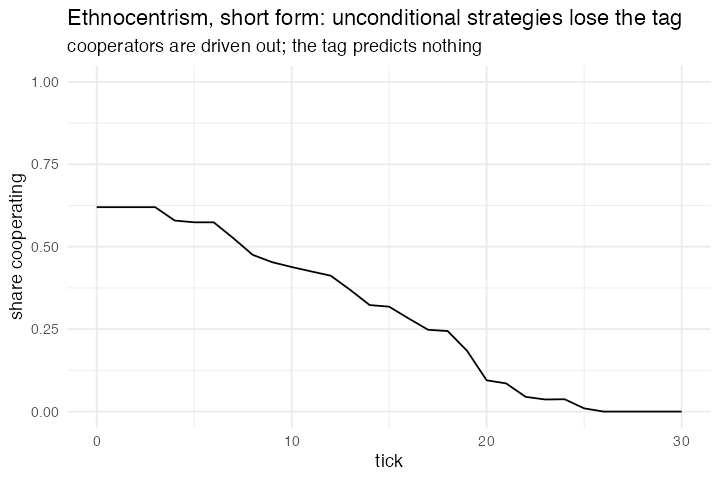

# 4. Ethnocentrism, short form

**Concept**

- Setup: 100 agents with a `tag`, a `strategy`, `resource = 10`
- Go: play, pay upkeep, reproduce above 20, die at 0
- Output: *supposed* to show in-group favouritism winning

**Package**

```r
ethno <- abm_setup(agents = abm_agents(
  n = 100,
  tag      = ~sample(c("red", "blue"), n, replace = TRUE),
  strategy = ~sample(c("cooperate", "defect"), n, replace = TRUE),
  resource = 10))

go <- abm_go(
  abm_match(pair = "random"),
  abm_rules(resource ~ case_when(
    strategy == "cooperate" & partner_strategy == "cooperate" ~ resource + 2,
    strategy == "defect"    & partner_strategy == "cooperate" ~ resource + 4,
    strategy == "cooperate" & partner_strategy == "defect"    ~ resource - 1,
    TRUE ~ resource) - 1),
  abm_birth(when = resource > 20, cost = resource ~ resource / 2),
  abm_death(when = resource <= 0)
)

result <- abm_run(ethno, go, ticks = 30, seed = 4)
```

*Introduced `abm_birth()` and `abm_death()` as two more flat steps. **It does not
work**. The tag does no work because strategies are unconditional, so defection
dominates and the population runs down. See model 15.*

**Replication**



**Reproduce:** [`04-ethnocentrism-short.R`](scripts/04-ethnocentrism-short.R)

---

← [3. PD Basic](03-pd-basic-well-mixed-prisoner-s-dilemma-with-imitation.md) · [all models](README.md) · [5. Rumour Mill](05-rumour-mill.md) →
