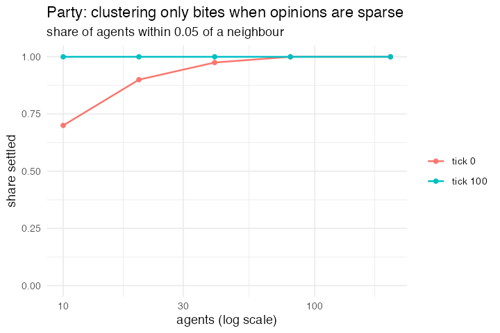

# 6. Party, segregation without geography

**Concept**

- Setup: 200 agents with a continuous `opinion`
- Go: find your nearest neighbour in opinion space; if even they are too far,
  jump to a fresh opinion
- Output: opinions cluster

**Package**

```r
party <- abm_setup(agents = abm_agents(n = 200, opinion = ~runif(n, 0, 1)))

go <- abm_go(
  abm_match(pair = "nearest", by = opinion),
  abm_rules(opinion ~ if_else(abs(opinion - partner_opinion) > 0.05, runif(1), opinion))
)

result <- abm_run(party, go, ticks = 100, seed = 6)
```

*Introduced `pair = "nearest"`, the first directional mode: your nearest neighbour
need not have you as theirs, so each agent gets its own `.group_id` and `runif(1)`
is drawn once per agent.*

**Replication**



**Reproduce:** [`06-party-segregation-without-geography.R`](scripts/06-party-segregation-without-geography.R)

---

← [5. Rumour Mill](05-rumour-mill.md) · [all models](README.md) · [7. Market](07-market-supply-and-demand.md) →
