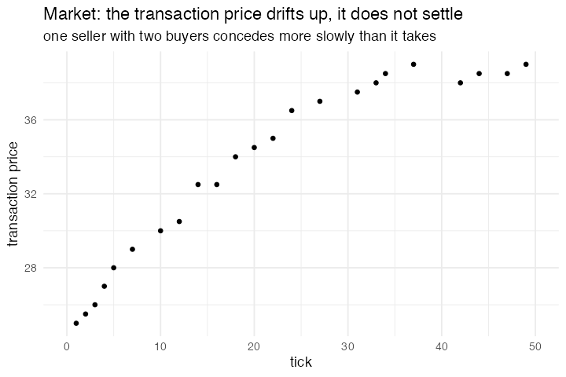

# 7. Market, bilateral bargaining

**Concept**

- Setup: one seller with a private `limit_price` (the least it will accept) and
  two buyers, each with a private `limit_price` (the most it will pay). Every
  agent also carries an `expected_price`, its opening position for the tick
- Go: reset the tick, pair across the two groups, trade at the midpoint when the
  buyer's `expected_price` has caught up to the seller's, then move each agent's
  `expected_price` for the next tick depending on whether it traded
- Output: with one seller and two buyers the seller is never short of a
  counterparty, so it raises its `expected_price` faster than it concedes and the
  transaction price drifts upward rather than settling

**Package**

```r
market <- abm_setup(agents = list(
  seller = abm_agents(n = 1, limit_price = 20, expected_price = 20,
                      transacted = FALSE, deal_price = NA_real_),
  buyer  = abm_agents(n = 2, limit_price = c(40, 35), expected_price = c(30, 25),
                      transacted = FALSE, deal_price = NA_real_)
))

go <- abm_go(
  abm_rules(transacted ~ FALSE, deal_price ~ NA_real_),

  abm_match(pair = "opposite_group", by = .group),

  abm_rules(
    transacted ~ case_when(
      .group == "seller" & partner_expected_price >= expected_price ~ TRUE,
      .group == "buyer"  & expected_price >= partner_expected_price ~ TRUE,
      TRUE ~ FALSE
    ),
    deal_price ~ if_else(
      (.group == "seller" & partner_expected_price >= expected_price) |
      (.group == "buyer"  & expected_price >= partner_expected_price),
      (expected_price + partner_expected_price) / 2, NA_real_
    )
  ),

  abm_rules(
    expected_price ~ case_when(
      .group == "seller" &  transacted ~ expected_price + 2,
      .group == "seller" & !transacted ~ pmax(expected_price - 1, limit_price),
      .group == "buyer"  &  transacted ~ expected_price - 1,
      .group == "buyer"  & !transacted ~ pmin(expected_price + 1, limit_price),
      TRUE ~ expected_price
    ),
    .scope = "population"
  )
)

result <- abm_run(market, go, ticks = 50, seed = 123)
```

```r
library(dplyr)
library(ggplot2)

result |>
  filter(.group == "seller") |>
  select(tick, deal_price) |>
  ggplot(aes(x = tick, y = deal_price)) +
  geom_point() +
  theme_minimal()
```

*Several agent groups, rule routing by `.group`, and `.scope = "population"` on
the step that has to reach every agent. Both `case_when()` blocks branch on
`.group`, the column `abm_setup()` writes from the list names, so there is no
separate agent-`type` field to keep in step. `opposite_group` matching partitions
the two groups into pairs, and with one seller and two buyers it forms exactly one
pair per tick: one buyer is left unmatched and gets no `partner_expected_price`,
so it falls to the `TRUE ~ FALSE` branch of the `transacted` rule.*

*The first `abm_rules()` step clears `transacted` and `deal_price` before the
match, so a tick where nobody trades reads as `NA` rather than carrying last
tick's number. The two rules inside the price step are evaluated against the same
start-of-step state, so `deal_price` recomputes the agreement condition instead of
reading `transacted`; splitting them into two `abm_rules()` calls would let the
second read the first's result. The `pmax`/`pmin` clamps hold each agent's
`expected_price` on its own side of its `limit_price`.*

*The last step carries `.scope = "population"` because the match from earlier in
the tick is still standing. Without it, `abm_rules()` would update only the
matched pair, and the unmatched buyer's `expected_price` would freeze until a tick
it is paired again. `"population"` makes the step ignore the standing match and
run over everyone, so the idle buyer takes the `!transacted` branch and bids
itself up toward its `limit_price` while it waits. The asymmetry in that step,
seller `+2` on a trade against `-1` for the buyers, is the rest of the model: the
seller with a captive pair of buyers concedes ground more slowly than it takes
it, and the deal price climbs.*

**Replication**



**Reproduce:** [`07-market-supply-and-demand.R`](scripts/07-market-supply-and-demand.R)

---

← [6. Party](06-party-segregation-without-geography.md) · [all models](README.md) · [8. Voter Model on a network](08-voter-model-on-a-network.md) →
