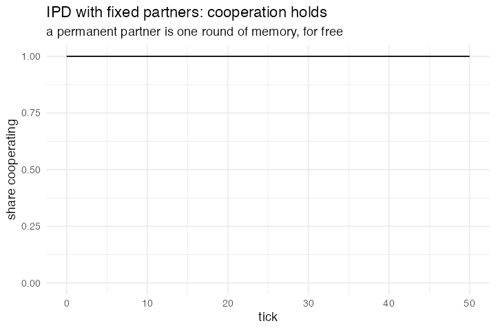

# 10. Iterated Prisoner's Dilemma with fixed partners

**Concept**

- Setup: 100 agents, `move = "cooperate"`, paired permanently
- Go: play, then copy your partner's last move
- Output: cooperation survives, unlike model 3

**Package**

```r
ipd <- abm_setup(
  agents  = abm_agents(n = 100, move = "cooperate", payoff = 0),
  network = abm_network(type = "random", degree = 1))

go <- abm_go(
  abm_match(pair = "network"),
  abm_rules(payoff ~ case_when(
    move == "cooperate" & partner_move == "cooperate" ~ 3,
    move == "defect"    & partner_move == "defect"    ~ 1,
    move == "defect"    & partner_move == "cooperate" ~ 5,
    move == "cooperate" & partner_move == "defect"    ~ 0)),
  abm_rules(move ~ partner_move)
)

result <- abm_run(ipd, go, ticks = 50, seed = 10)
```

*Introduced nothing. `abm_network(degree = 1)` gives fixed partnerships and the
`partner_*` convention already carries last tick's move forward. One round of
memory comes free. Anything longer needs an explicit column (see model 26).*

**Replication**



**Reproduce:** [`10-iterated-prisoner-s-dilemma-with-fixed-partners.R`](scripts/10-iterated-prisoner-s-dilemma-with-fixed-partners.R)

---

← [9. Public Goods Game](09-public-goods-game.md) · [all models](README.md) · [11. Preferential Attachment](11-preferential-attachment.md) →
