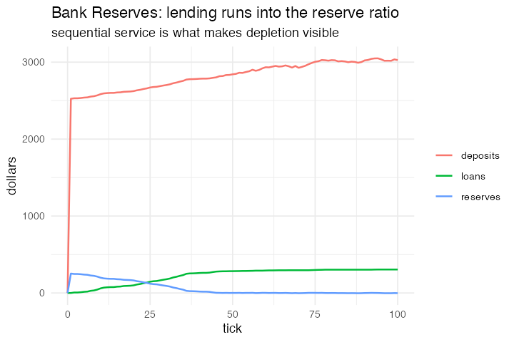

# 13. Bank Reserves (Wilensky, NetLogo Social Science)

**Concept**

- Setup: 100 people with a `wallet`, `savings` and `loan`; a bank ledger
- Go: exchange cash pairwise, settle up individually, then borrow from the bank,
  but only while it has lendable reserves
- Output: the money multiplier

**NetLogo**

```netlogo
to take-out-loan  ;; turtle procedure, called via a plain `ask turtles`
  if (wallet < 0) and (savings = 0) and (bank-to-loan > 0) [
    let amount min (list (- wallet) bank-to-loan)
    set loans (loans + amount)  set wallet (wallet + amount)
    set bank-to-loan (bank-to-loan - amount) ]
end
```

**Package**

```r
reserve_ratio <- 0.1

bankres <- abm_setup(
  agents  = abm_agents(n = 100, wallet = ~runif(n, 0, 50), savings = 0,
                       loan = 0, draw = 0),
  globals = list(bank_deposits = 0, bank_loans = 0, bank_reserves = 0))

go <- abm_go(
  abm_match(pair = "random", role = list(giver = TRUE, receiver = TRUE)),
  abm_rules(gift ~ sample(c(0, 2, 5), 1)),
  abm_rules(wallet ~ if_else(.role == "giver", wallet - gift, wallet + partner_gift)),
  abm_rules(
    savings ~ if_else(wallet > 0, savings + wallet, savings - pmin(savings, abs(wallet))),
    wallet  ~ if_else(wallet > 0, 0, wallet + pmin(savings, abs(wallet)))),
  abm_global(bank_deposits ~ sum(savings)),
  abm_sequential(
    draw          ~ if_else(wallet < 0 & bank_reserves > 0,
                            pmin(-wallet, bank_reserves), 0),
    loan          ~ loan + draw,
    wallet        ~ wallet + draw,
    bank_reserves ~ bank_reserves - draw),
  abm_global(bank_loans    ~ sum(loan)),
  abm_global(bank_reserves ~ bank_deposits * reserve_ratio - bank_loans)
)

result <- abm_run(bankres, go, ticks = 100, seed = 13)
```

*Introduced `abm_sequential()`. Every earlier model is fine with simultaneous
updates because a shared pool that is only ever **divided** gives the same answer
either way. Lendable reserves are **depleted**, so the first borrower has to
change what the second one sees. The last rule writes to a global, and that is what
makes the depletion visible to the next agent.*

*Rewritten in Part 5, when rules inside `abm_sequential()` started to cascade.
The amount drawn is now worked out once, into `draw`, and the three rules that
move money refer to it. The original wrote the condition
`wallet < 0 & bank_reserves > 0` out three times, which was right when every
rule read the agent's row as it stood at the start of the step and is wrong now
that the second rule brings `wallet` back to zero before the third one tests it.
The model is the same. It is the version of it that survives a change in the
step's semantics, and it reads better than the original did.*

**Replication**



**Reproduce:** [`13-bank-reserves.R`](scripts/13-bank-reserves.R)

---

← [12. Random Consumption Zakah, short form](12-random-consumption-zakah-short.md) · [all models](README.md) · [14. El Farol with inductive agents](14-el-farol-with-inductive-agents.md) →
