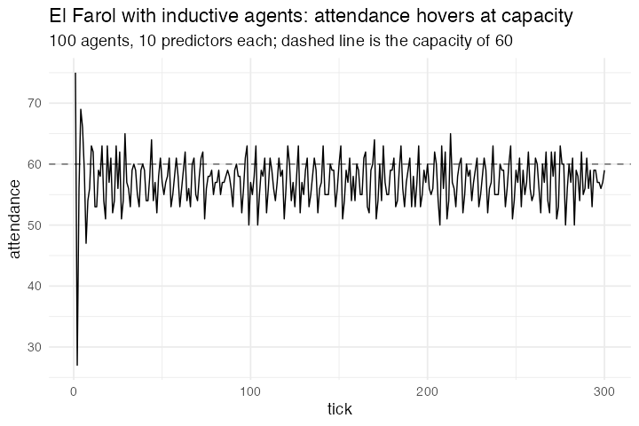

# 14. El Farol with inductive agents (Arthur 1994)

**What was missing.** The short form gives every agent the same forecast, so the
population is one agent chasing its own tail. Heterogeneous *fixed* forecasts do
not help either, the map is still deterministic and still converges. Arthur's
mechanism is inductive: each agent holds several candidate predictors, scores them
against what actually happened, and acts on whichever has been working.

**Package**

Each agent carries a matrix of predictor weights and a vector of scores, both in
list columns. There is no switching step: "act on whichever has been working" is
`which.min(e)` read at the moment of acting.

```r
MEMORY <- 5; N_STRAT <- 10; CAPACITY <- 60

farol <- abm_setup(
  agents = abm_agents(
    n = 100,
    w = ~lapply(seq_len(n), function(i)
          matrix(runif(N_STRAT * (MEMORY + 1), -1, 1), N_STRAT, MEMORY + 1)),
    e = ~lapply(seq_len(n), function(i) numeric(N_STRAT)),
    p = ~lapply(seq_len(n), function(i) numeric(N_STRAT)),
    go_today = FALSE),
  globals = as.list(setNames(rep(CAPACITY, MEMORY), paste0("att", 1:MEMORY))),
  seed = 1)

go <- abm_go(
  abm_rules(p ~ lapply(w, function(W) as.vector(W %*% c(100, att1, att2, att3, att4, att5)))),
  abm_rules(go_today ~ mapply(function(pi, ei) pi[which.min(ei)], p, e) < CAPACITY),
  abm_global(att5 ~ att4, att4 ~ att3, att3 ~ att2, att2 ~ att1,
             att1 ~ sum(go_today)),
  abm_rules(e ~ mapply(function(ei, pi) 0.8 * ei + 0.2 * abs(pi - att1),
                       e, p, SIMPLIFY = FALSE))
)

result <- abm_run(farol, go, ticks = 300, seed = 2)
```

**Result.** Last 200 of 300 ticks: attendance mean 57.2, sd 3.4, range 50–65, 16
distinct levels and no period up to lag 6. The pool size is the mechanism, not
the inductive machinery on its own: across four population draws, ten predictors
never settles, three settles in two draws of four, and one predictor settles in
all four, at a fixed point or a two-cycle.

*Needed nothing new, and the entry it was filed under was wrong.* This model was
first written as seventy scalar columns and five blocks of
`rlang::new_formula()` scaffolding, and cited as proof that an agent could not
hold a set. Model 41 found the list column and this one was rewritten around it.
Both seeds are load-bearing: `abm_setup(seed =)` fixes which predictors the
agents are born with and changes the answer as much as `abm_run(seed =)` does.

**Replication**



**Reproduce:** [`14-el-farol-with-inductive-agents.R`](scripts/14-el-farol-with-inductive-agents.R)

---

← [13. Bank Reserves](13-bank-reserves.md) · [all models](README.md) · [15. Ethnocentrism, Hammond & Axelrod](15-ethnocentrism-hammond-axelrod.md) →
