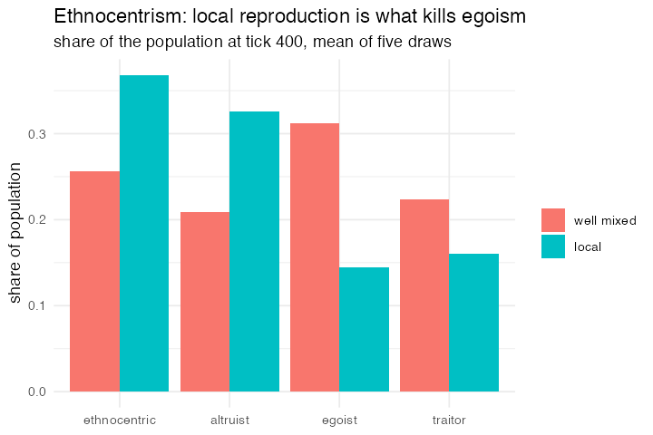

# 15. Ethnocentrism, Hammond & Axelrod (2006)

**What was missing.** Two things. Agents need *two* strategy bits, cooperate
with your own tag, cooperate with others, or the tag does no work. And that alone
is not enough: in a well-mixed population egoists still win, which is the paper's
own control condition. The result needs **local reproduction**, so that your
neighbours are disproportionately your kin and "same tag" starts predicting "will
cooperate with me".

**Package**

```r
COST <- 0.01; BENEFIT <- 0.03; BASE_PTR <- 0.12; DEATH <- 0.10; CAPACITY <- 800

random_traits <- list(
  tag      ~ sample(c("red", "blue"), n(), replace = TRUE),
  coop_in  ~ sample(c(TRUE, FALSE),   n(), replace = TRUE),
  coop_out ~ sample(c(TRUE, FALSE),   n(), replace = TRUE))

pop <- abm_setup(
  agents  = abm_agents(n = 400,
                       tag      = ~sample(c("red", "blue"), n, replace = TRUE),
                       coop_in  = ~sample(c(TRUE, FALSE), n, replace = TRUE),
                       coop_out = ~sample(c(TRUE, FALSE), n, replace = TRUE),
                       ptr      = BASE_PTR),
  network = abm_network(type = "random", degree = 4),
  seed    = 1)

go <- abm_go(
  abm_match(pair = "network"),
  abm_rules(give ~ if_else(partner_tag == tag, coop_in, coop_out)),
  abm_rules(ptr ~ BASE_PTR - COST * give + BENEFIT * partner_give),
  abm_birth(when = runif(n()) < ptr, links = 4,
            attach_via = abm_match(pair = "network", from = "parent")),
  abm_death(when = runif(n()) < DEATH + 0.25 * pmax(0, (n() - CAPACITY) / CAPACITY)),
  abm_birth(n = 8, links = 4, inherit = random_traits,
            attach_via = abm_match(pair = "network"))
)

result <- abm_run(pop, go, ticks = 400, seed = 1)
```

**Result** (means over five population draws, tick 400):

| | ethnocentric | altruist | egoist | traitor |
|---|---|---|---|---|
| well mixed | 0.225 | 0.138 | **0.373** | 0.264 |
| local | **0.368** | 0.326 | 0.145 | 0.161 |

Local reproduction is what kills egoism, from 0.37 to 0.15, and the two
strategies that cooperate in-group take three quarters of the population. Which
of those two leads is not robust at this parameterisation: ethnocentrics average
0.37 against altruists' 0.33 but lead in only two draws of five, because
clustering this strong makes out-group encounters rare enough that refusing them
saves little. 85% of edges join same-tag agents, where 50% is chance.

*Motivated `from = "parent"` and then `links`.* The first put an offspring next
to its parent, which nothing else could. The second turned out to be needed for
the same run to mean anything: a newborn with a single edge is a leaf, and with
deaths pruning four edges for every one a birth adds, the 4-regular graph was
gone in twenty-five ticks. The run behind the original write-up of this model
ended with a mean degree of 0.97 and 27% of agents joined to nobody, and its
headline 0.955 same-tag share was really counting parent-child pairs. `links =
4` keeps the network at degree 3.3 with 5% isolated. The strategy shares hardly
move, which is the point: the mechanism was real and the eroded network was
overstating the evidence for it.

**Replication**



**Reproduce:** [`15-ethnocentrism-hammond-axelrod.R`](scripts/15-ethnocentrism-hammond-axelrod.R)

---

← [14. El Farol with inductive agents](14-el-farol-with-inductive-agents.md) · [all models](README.md) · [16. Zakah with a risk process](16-zakah-with-a-risk-process.md) →
