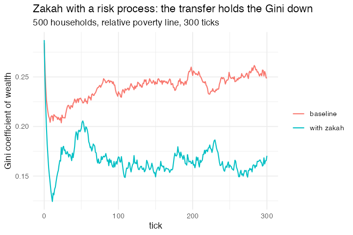

# 16. Zakah with a risk process

**What was missing.** Two things, and only one is the threshold. The poverty line
was absolute in a model where wealth grows, so everyone crosses it within about
ten ticks. More importantly, the consumption rule `wealth*0.98 + 0.4*income`
converges every household to exactly `20 * income`, so wealth becomes a
deterministic function of income, the distribution *tightens*, and nobody is ever
persistently poor no matter where the line is. A redistribution model needs
something to redistribute against.

**Package**

```r
NISAB <- 100

pop <- abm_setup(
  agents  = abm_agents(n = 500, wealth = ~rlnorm(n, 4, 0.5),
                       income = ~rlnorm(n, 3, 0.4)),
  globals = list(zakah_pool = 0, poverty_line = 30))

shocks <- abm_rules(
  income ~ exp(0.9 * log(income) + 0.1 * 3 + rnorm(n(), 0, 0.15)),   # AR(1) in logs
  wealth ~ wealth - if_else(runif(n()) < 0.03, wealth * 0.6, 0))     # occasional hit

go <- abm_go(
  shocks,
  abm_rules(wealth ~ pmax(0.01, wealth + income - (0.6 * income + 0.02 * wealth))),
  abm_global(poverty_line ~ 0.5 * median(wealth)),                   # relative
  abm_global(zakah_pool ~ sum(if_else(wealth > NISAB, wealth * 0.025, 0))),
  abm_rules(wealth ~ if_else(wealth > NISAB, wealth * 0.975, wealth)),
  abm_rules(wealth ~ if_else(wealth < poverty_line,
                             wealth + zakah_pool / pmax(1, sum(wealth < poverty_line)),
                             wealth))
)

result <- abm_run(pop, go, ticks = 300, seed = 12)
```

**Result.** Baseline: ~11% persistently below half the median. With zakah: none.
p10 rises 108 → 143 and the Gini falls 0.249 → 0.170.

*Caveat on calibration: moving 2.5% of nearly everyone's wealth to the few per
cent below the line is an enormous per-head transfer, which is why relative
poverty is eliminated rather than merely reduced. Real zakah is levied on
zakatable assets held for a year and split across eight categories, of which the
poor are two.*

**Replication**



**Reproduce:** [`16-zakah-with-a-risk-process.R`](scripts/16-zakah-with-a-risk-process.R)

---

← [15. Ethnocentrism, Hammond & Axelrod](15-ethnocentrism-hammond-axelrod.md) · [all models](README.md) · [17. Giant Component](17-giant-component.md) →
