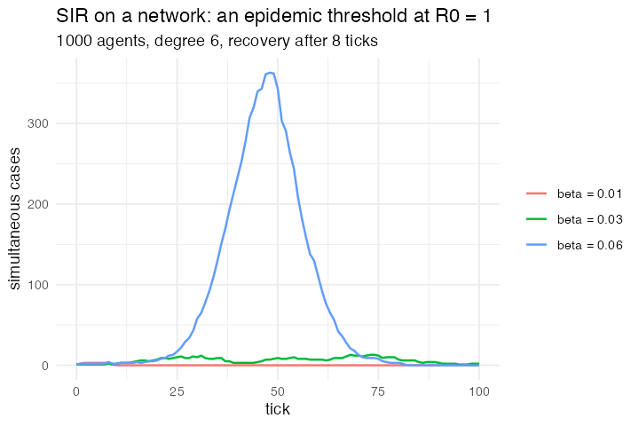

# 20. SIR on a network with recovery timers

**Concept**

- Setup: 1000 agents on a 6-regular network, one infected, a `timer` each
- Go: each susceptible is infected with probability `1 - (1-β)^(infected neighbours)`;
  the infected recover after a fixed duration
- Output: an epidemic threshold, below R₀ = 1 it dies out, above it takes off

**Package**

```r
BETA <- 0.06; DURATION <- 8

sir <- abm_setup(
  agents  = abm_agents(n = 1000, state = ~c("infected", rep("susceptible", n - 1)),
                       timer = 0),
  network = abm_network(type = "random", degree = 6))

go <- abm_go(
  abm_neighbours(inf_nbrs ~ sum(state == "infected")),
  abm_rules(state ~ if_else(
    state == "susceptible" & runif(n()) < 1 - (1 - BETA)^coalesce(inf_nbrs, 0),
    "infected", state)),
  abm_rules(timer ~ if_else(state == "infected", timer + 1, timer)),
  abm_rules(state ~ if_else(state == "infected" & timer > DURATION, "recovered", state))
)

result <- abm_run(sir, go, ticks = 100, seed = 2)
```

**Result.** β = 0.01 (R₀ ≈ 0.5) → 0.1% infected ever. β = 0.03 (R₀ ≈ 1.4) → 0.8%.
β = 0.06 (R₀ ≈ 2.9) → 92%, peaking at 349 simultaneous cases around tick 33.

*Needed nothing new once `abm_neighbours()` existed. A duration-based state
machine is just a counter column plus two rules, the same shape as
Ethnocentrism's `resource`.*

**Replication**



**Reproduce:** [`20-sir-on-a-network-with-recovery-timers.R`](scripts/20-sir-on-a-network-with-recovery-timers.R)

---

← [19. Fireflies](19-fireflies.md) · [all models](README.md) · [21. Genetic Drift / Wright–Fisher](21-genetic-drift-wright-fisher.md) →
