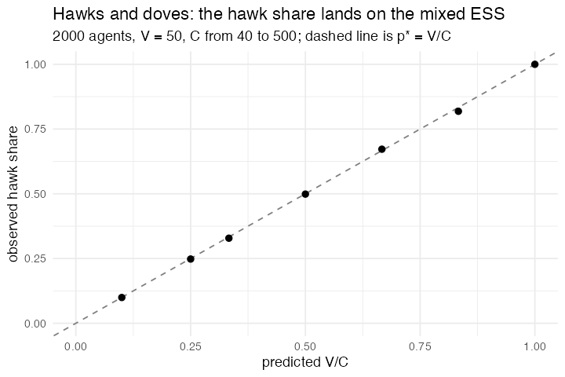

# 22. Hawks and Doves (Maynard Smith & Price 1973)

**Concept**

- Setup: 2000 agents, hawk or dove
- Go: contest a resource worth V; hawk/hawk costs both (V−C)/2, hawk/dove gives
  the hawk V and the dove 0, dove/dove splits V. Then the next generation is
  drawn from this one in proportion to fitness
- Output: when C > V the hawk share converges on the mixed ESS **p\* = V/C**

**Package**

```r
V <- 50; C <- 100

hd <- abm_setup(agents = abm_agents(
  n = 2000, strategy = ~sample(c("hawk", "dove"), n, replace = TRUE), payoff = 0))

go <- abm_go(
  abm_match(pair = "random"),
  abm_rules(payoff ~ case_when(
    strategy == "hawk" & partner_strategy == "hawk" ~ (V - C) / 2,
    strategy == "hawk" & partner_strategy == "dove" ~ V,
    strategy == "dove" & partner_strategy == "hawk" ~ 0,
    TRUE                                           ~ V / 2)),
  abm_rules(fitness ~ payoff - min((V - C) / 2, 0) + 1),
  abm_rules(strategy ~ sample(strategy, n(), replace = TRUE, prob = fitness),
            .scope = "population")
)

result <- abm_run(hd, go, ticks = 200, seed = 4)
```

**Result.** Quantitative, not just qualitative:

| C | predicted V/C | observed |
|---|---|---|
| 60 | 0.833 | 0.833 |
| 75 | 0.667 | 0.662 |
| 100 | 0.500 | 0.499 |
| 150 | 0.333 | 0.334 |
| 200 | 0.250 | 0.253 |
| 500 | 0.100 | 0.102 |
| 40 (V > C) | 1.000 | 1.000 |

*Motivated `.scope = "population"`. Without it the resampling rule inherited the
grouping from the preceding `abm_match()` and resampled **within each pair**,
which drove hawks to fixation at every parameter value. This model is the
package's best quantitative validation: the analytic ESS is matched to three
decimals across a 12-fold range of C.*

*Note also that pairwise imitation, meaning "copy your partner if they did
better", does **not** reproduce V/C, because a single contest's payoff is not a
fitness.
Both the symmetric version (both partners copying each other) and the
one-directional version drift toward 0.5 regardless of C.*

**Replication**



**Reproduce:** [`22-hawks-and-doves.R`](scripts/22-hawks-and-doves.R)

---

← [21. Genetic Drift / Wright–Fisher](21-genetic-drift-wright-fisher.md) · [all models](README.md) · [23. Divide the Cake](23-divide-the-cake.md) →
