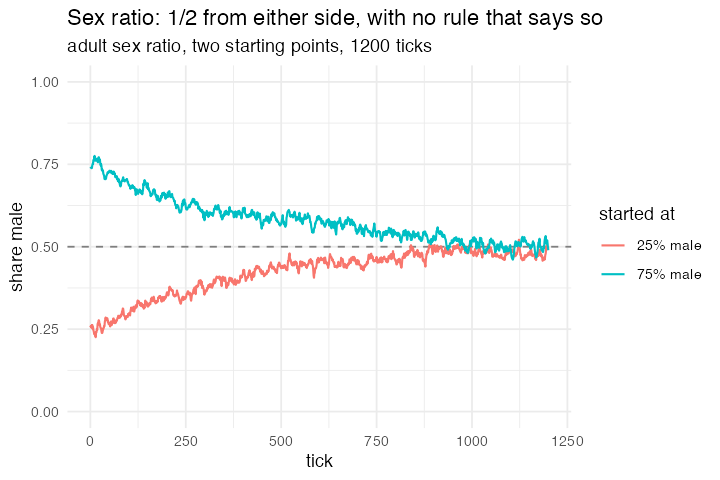

# 24. Sex Ratio Equilibrium (Fisher; NetLogo Biology)

**Concept**

- Setup: 1000 agents with a sex, an age, and an inherited `mcc`, the probability
  that this individual's children are male
- Go: age and die past longevity; mature males and females pair off; each mated
  female bears one child whose `mcc` is the parents' average plus mutation and
  whose sex is drawn from that average
- Output: the adult sex ratio converges on 1/2 from any starting point, Fisher's
  principle

**Package**

```r
LONGEVITY <- 8; MATURITY <- 2; MATING <- 0.6; CAP <- 1500

pop <- abm_setup(agents = abm_agents(
  n   = 1000,
  sex = ~sample(c("male", "female"), n, replace = TRUE, prob = c(0.25, 0.75)),
  mcc = ~pmin(0.95, pmax(0.05, rnorm(n, 0.25, 0.08))),
  age = ~sample(0:LONGEVITY, n, replace = TRUE)))

go <- abm_go(
  abm_rules(age ~ age + 1),
  abm_death(when = age > LONGEVITY),
  abm_death(when = runif(n()) < pmax(0, (n() - CAP) / n())),
  abm_match(pair = "opposite_group", by = sex, eligible = age >= MATURITY),
  abm_birth(
    when = sex == "female" & !is.na(.partner) & runif(n()) < MATING,
    inherit = list(
      age ~ 0,
      mcc ~ pmin(0.95, pmax(0.05, (mcc + partner_mcc) / 2 + rnorm(n(), 0, 0.05))),
      sex ~ if_else(runif(n()) < (mcc + partner_mcc) / 2, "male", "female")))
)

result <- abm_run(pop, go, ticks = 1200, seed = 2)
```

**Result.** Starting at 25% male: 0.24 → 0.47 → 0.48, with mean `mcc` moving
0.25 → 0.47. Starting at 75% male: 0.74 → 0.49, with `mcc` moving 0.75 → 0.50.

*Motivated `abm_birth(inherit =)`. `cost` applies to the parent **and** the
child, so a newborn that differs from its parent, whether by a reset age, a
mutated trait or a sex drawn at birth, had no expression. Because `inherit` is evaluated in the parent's row
with the match standing, `partner_mcc` is available, and that is what makes
two-parent inheritance a one-liner.*

*The Fisherian feedback comes out of the matching, not out of any rule:
`"opposite_group"` pairs `min(n_male, n_female)` couples, so when males are scarce
each male fathers more children and a parent who produces sons has more
grandchildren.*

**Replication**



**Reproduce:** [`24-sex-ratio-equilibrium.R`](scripts/24-sex-ratio-equilibrium.R)

---

← [23. Divide the Cake](23-divide-the-cake.md) · [all models](README.md) · [25. Axelrod's cultural dissemination](25-axelrod-s-cultural-dissemination.md) →
