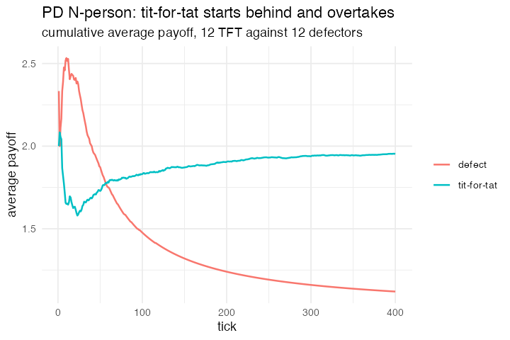

# 26. PD N-Person Iterated (NetLogo Social Science)

**Concept**

- Setup: N agents, each with one of six fixed strategies, random, cooperate,
  defect, tit-for-tat, unforgiving, unknown
- Go: pair off, play one round of PD (T=5, R=3, P=1, S=0), remember what **this
  particular opponent** did
- Output: defect beats unconditional cooperation; tit-for-tat ties with
  cooperators at 3; and against defectors tit-for-tat starts behind and overtakes
  as it learns each individual defector

**NetLogo**

```netlogo
to tit-for-tat
  set partner-defected? item ([who] of partner) partner-history
  ifelse partner-defected? [ set defect-now? true ] [ set defect-now? false ]
end
to unforgiving-history-update
  if partner-defected? [ set partner-history
    (replace-item ([who] of partner) partner-history true) ]   ;; latches forever
end
```

**Package**

Per-opponent memory is a **set** per agent, the `.id`s of everyone who has
defected on me, held in one list column and indexed with `.partner`:

```r
pop <- abm_setup(agents = abm_agents(
  n = N, strategy = strategies, score = 0, games = 0, defect_now = FALSE,
  grudges = ~vector("list", n)))

go <- abm_go(
  abm_match(pair = "random"),
  abm_rules(remembered ~ mapply(function(g, p) p %in% g, grudges, .partner)),
  abm_rules(defect_now ~ case_when(
    strategy == "defect"    ~ TRUE,
    strategy == "cooperate" ~ FALSE,
    strategy == "random"    ~ runif(n()) < 0.5,
    TRUE                    ~ remembered)),
  abm_rules(payoff ~ case_when(
    !defect_now & !partner_defect_now ~ 3,
    !defect_now &  partner_defect_now ~ 0,
     defect_now & !partner_defect_now ~ 5,
    TRUE                              ~ 1)),
  abm_rules(score ~ score + payoff, games ~ games + 1),
  abm_rules(grudges ~ Map(function(g, p, d, s) {
    if (s == "unforgiving")      if (d) union(g, p) else g
    else if (s == "tit-for-tat") if (d) union(g, p) else setdiff(g, p)
    else g
  }, grudges, .partner, partner_defect_now, strategy))
)

result <- abm_run(pop, go, ticks = 400, seed = 5)
```

**Result** (N = 24, average payoff = cumulative score / cumulative games):

| matchup | outcome |
|---|---|
| cooperate vs defect | defect 3.07, cooperate 1.45 |
| tit-for-tat vs cooperate | both exactly 3.00 |
| tit-for-tat vs defect | tick 5: defect 2.33, TFT 1.87 · tick 20: 2.40 / 1.63 · tick 100: 1.48 / **1.83** · tick 400: 1.12 / **1.95** |

*The crossover is the model's signature curve and it comes out cleanly.*

*Needed nothing new. This model was first written with one memory column per
possible opponent, N columns for N agents, so N² cells, plus a `case_when()` of
N branches to read one of them and N generated rules to write them back. It was
filed as a gap in the grammar alongside El Farol's weights, and it was not one:
the same memory is one list column, read with `.partner` the way model 41 reads
a strategy table. The rewrite is bit-identical to the N² version, because the
representation was the only thing that changed and no rule over it draws a
random number. It also drops the sparse half of the old cost: the set holds only
the opponents that actually defected, where the N² version stored a `FALSE` for
every pair that never met, so N = 60 is now the same model as N = 24 rather than
a different exercise in `do.call()`.*

*The grudge update is the one place the two representations read differently.
Latching and forgiving are `union()` and `setdiff()` on a set, which is what the
strategies mean; spread across columns they were a `case_when()` that had to name
the opponent's index to leave every other column alone.*

*One honest difference from NetLogo: there, agents wander a 441-patch world and
meet sparsely, so opponents recur rarely and defect usually posts the best average.
Here everyone is paired every tick out of 24, so each pair meets roughly every
23 ticks and the retaliatory strategies get enough encounters to learn. In the
all-six run, unforgiving (2.64) and tit-for-tat (2.52) beat defect (2.28). That
difference **is** the game-theoretic point, retaliation pays when re-encounters
are frequent, but it means the two implementations are answering slightly
different questions.*

**Replication**



**Reproduce:** [`26-pd-n-person-iterated.R`](scripts/26-pd-n-person-iterated.R)

---

← [25. Axelrod's cultural dissemination](25-axelrod-s-cultural-dissemination.md) · [all models](README.md) · [27. Threshold model of collective behaviour](27-threshold-model-of-collective-behaviour.md) →
