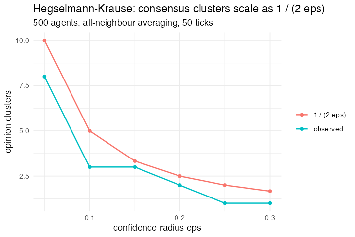

# 29. Bounded confidence, all-neighbour (Hegselmann & Krause 2002)

**Concept**

- Setup: 500 agents with opinions drawn uniformly on [0, 1]
- Go: each agent moves to the *mean* of everybody within `eps` of it, not one
  partner, everybody
- Output: consensus above a critical `eps`, fragmentation below it

**Package**

```r
hk <- function(eps, n = 500, ticks = 50) {
  pop <- abm_setup(agents = abm_agents(n = n, opinion = ~runif(n)),
                   globals = list(eps = eps), seed = 42)
  go <- abm_go(
    abm_neighbours(opinion ~ mean(opinion),
                   within = abs(opinion - own_opinion) <= eps)
  )
  abm_run(pop, go, ticks = ticks)
}
```

**Result.**

| `eps` | 0.30 | 0.25 | 0.20 | 0.15 | 0.10 | 0.05 |
|---|---|---|---|---|---|---|
| clusters | 1 | 1 | 2 | 3 | 3 | 8 |

Consensus for `eps ≥ 0.25`, fragmentation below, the transition the paper
reports.

*Forced `abm_neighbours(within =)`, one round later.* When this model was first
written the averaging was expressible, with no match standing, a rule sees the
whole population as vectors, but only as a hand-rolled `vapply()` that is O(n²)
and reads like base R rather than like a step, because `abm_neighbours()`
aggregated over the **network** and nothing else. `within =` is the fix: the
neighbourhood is everybody whose columns satisfy a condition, evaluated once per
(focal, candidate) pair with the focal agent's columns under `own_<col>`. It is
the same view `abm_match(cost =)` minimises over, with an aggregate on the end
instead of an argmin, which is why the machinery already existed. The table above
is unchanged, since the step produces the same run as the `vapply()` did, agent
for agent.

*One thing had to be decided rather than inherited. An agent is inside its own
attribute neighbourhood, because "the mean opinion of everyone I take seriously"
includes the agent's own and Hegselmann and Krause's confidence set is defined
that way. It is never inside its own network neighbourhood, because an agent is
not joined to itself. `within = ... & .id != own_.id` excludes it.*

**Replication**



**Reproduce:** [`29-bounded-confidence-all-neighbour.R`](scripts/29-bounded-confidence-all-neighbour.R)

---

← [28. Bounded confidence, pairwise](28-bounded-confidence-pairwise.md) · [all models](README.md) · [30. Norms and metanorms](30-norms-and-metanorms.md) →
