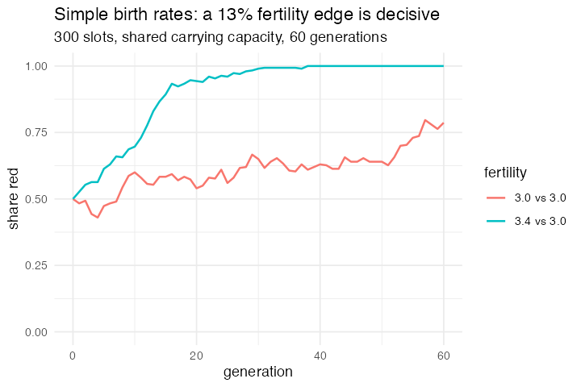

# 31. Simple Birth Rates (Wilensky 1997, NetLogo Biology)

**Concept**

- Setup: a population at carrying capacity, half red and half blue, differing
  only in fertility. A fertility of 3.4 means "three children, and a 40% chance
  of a fourth"
- Go: everybody reproduces, then the population is culled at random back to the
  carrying capacity
- Output: a small fertility advantage is enough to drive the other population
  extinct, and the culling is colour-blind, so nothing is selecting *against*
  the losers

**NetLogo**

```netlogo
to go
  ask turtles [ reproduce ]
  while [count turtles > carrying-capacity] [ ask one-of turtles [ die ] ]
  tick
end
```

**Package**

```r
K <- 300                                   # carrying capacity

pop <- abm_setup(
  agents  = abm_agents(n = K,
                       colour = ~rep(c("red", "blue"), length.out = n),
                       fert   = ~if_else(rep(c("red", "blue"), length.out = n) == "red",
                                         3.4, 3.0),
                       parent = FALSE),
  globals = list(K = K),
  seed    = 1)

child <- abm_birth(when    = parent & runif(n()) < pmin(fert - born, 1),
                   cost    = born ~ born + 1,
                   inherit = list(parent ~ FALSE, born ~ 0))

go <- do.call(abm_go, c(
  list(abm_rules(parent ~ TRUE, born ~ 0)),
  rep(list(child), 4),
  list(abm_death(when = rank(runif(n()), ties.method = "random") > K))
))

result <- abm_run(pop, go, ticks = 40, seed = 1)
```

**Result.** Carrying capacity 300, reds on 3.4 against blues on 3.0, starting
150/150:

| generation | 0 | 5 | 10 | 20 | 40 |
|---|---|---|---|---|---|
| reds | 150 | 184 | 209 | 283 | 300 |

Blues extinct at generation 38. With both on 3.0 the reds sit at 236 after 60
generations and keep wandering, drift, not selection.

*Needed nothing new, but it exposed a rough edge.* `abm_birth()` gives a parent
**one** offspring, and this model needs three or four. The `parent` flag plus a
repeated birth step does it, the flag keeps newborns out of the later births, so
nobody becomes a grandparent inside a single generation, but `abm_birth(times =)`
would say it directly. The one expression `runif(n()) < pmin(fert - born, 1)`
covers both the whole children and the fractional one.

**Replication**



**Reproduce:** [`31-simple-birth-rates.R`](scripts/31-simple-birth-rates.R)

---

← [30. Norms and metanorms](30-norms-and-metanorms.md) · [all models](README.md) · [32. Team Assembly](32-team-assembly.md) →
