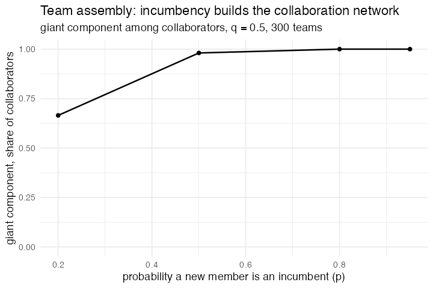

# 32. Team Assembly (Guimerà, Uzzi, Spiro & Amaral 2005; NetLogo Networks)

**Concept**

- Setup: an empty collaboration network
- Go: a team of `m` is assembled one member at a time. Each new member is an
  incumbent with probability `p`; when an incumbent is chosen, with probability
  `q` it is drawn from the past collaborators of someone already on the team.
  Everyone on the finished team is linked to everyone else. Agents who have not
  been on a team for `max-downtime` ticks retire
- Output: the field's collaboration network is either one connected community or
  a scatter of isolated cliques, and which one depends on `p` and `q`

**Package**

```r
m <- 5                                     # team size
p <- 0.5; q <- 0.5; downtime <- 20

pop <- abm_setup(
  agents  = abm_agents(n = m, collabs = 0, idle = 0, on_team = FALSE),
  network = abm_network(type = "empty"),
  globals = list(p = p, q = q, u_type = 0, u_q = 0),
  seed    = 1)

recruit <- list(
  abm_global(u_type ~ runif(1), u_q ~ runif(1)),
  abm_neighbours(near_team ~ any(on_team)),
  abm_rules(score ~ (!on_team) * case_when(
    u_type <  p & u_q < q & collabs > 0 & coalesce(near_team, FALSE) ~ 3,
    u_type <  p & collabs > 0                                       ~ 2,
    u_type >= p & collabs == 0                                      ~ 2,
    collabs == 0                                                    ~ 1,
    TRUE                                                            ~ 0)),
  abm_rules(score   ~ score + runif(n())),
  abm_rules(on_team ~ on_team | (score > 1 & rank(-score, ties.method = "first") == 1))
)

go <- do.call(abm_go, c(
  list(abm_birth(n = m, inherit = list(collabs ~ 0, idle ~ 0, on_team ~ FALSE)),
       abm_rules(on_team ~ FALSE, idle ~ idle + 1)),
  rep(recruit, m),                                   # m members, one at a time
  list(abm_match(pair = "random", size = m, eligible = on_team),
       abm_link(),                                   # the team becomes a clique
       abm_rules(collabs ~ collabs + 1, idle ~ 0),
       abm_death(when = collabs == 0 & idle > downtime))
))

result <- abm_run(pop, go, ticks = 300, seed = 1)
```

**Result.** Teams of 5, 300 ticks, share of collaborators in the giant component:

| `p` | 0.20 | 0.50 | 0.80 | 0.95 | 0.50 (`q` = 0.95) |
|---|---|---|---|---|---|
| giant component | 0.66 | 0.98 | 1.00 | 1.00 | 0.89 |

More incumbents connect the field. Heavy repeat collaboration (`q = 0.95`) starts
to fragment it again. That is the paper's phase diagram.

*Forced clique linking in `abm_link()`.* A matched group of three or more now
gains an edge between every pair inside it, which is what a team, a committee or
a coalition means once it is written as a network. The other half of this model,
assembling the team **one member at a time**, turned out to be expressible after
all, by repeating a five-step `recruit` block `m` times and carrying the partial
team in an `on_team` column. That is the first model in the corpus with a
constructive, order-dependent sub-loop inside a single tick.

**Replication**



**Reproduce:** [`32-team-assembly.R`](scripts/32-team-assembly.R)

---

← [31. Simple Birth Rates](31-simple-birth-rates.md) · [all models](README.md) · [33. Language Change](33-language-change.md) →
