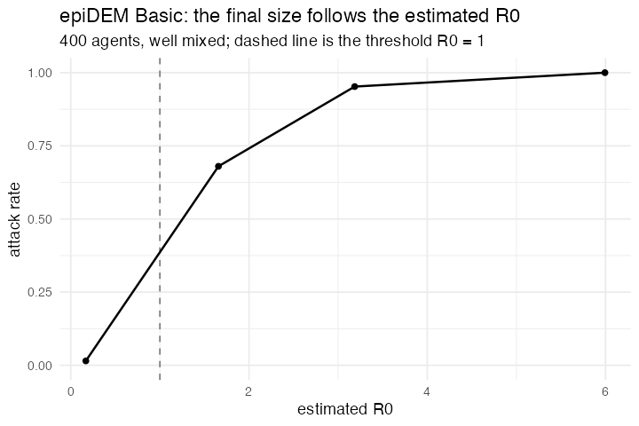

# 34. epiDEM Basic (Yang & Wilensky 2011, NetLogo)

**Concept**

- Setup: a well-mixed population, a few infected
- Go: everyone bumps into one other agent and may pass on the infection; each
  agent has its own recovery time drawn from a normal, and recovery confers
  permanent immunity
- Output: R₀ estimated from the susceptible curve, and an epidemic only when it
  exceeds 1

**NetLogo**

```netlogo
to go
  ask turtles [ move  infect  maybe-recover ]
  calculate-r0
  tick
end
```

**Package**

```r
pop <- abm_setup(
  agents  = abm_agents(n = 400,
                       state    = ~if_else(seq_len(n) <= i0, "I", "S"),
                       sick_for = 0,
                       recover_after = ~pmax(1, rnorm(n, avg_recovery,
                                                      avg_recovery / 4))),
  globals = list(inf_p = infection_chance, rec_p = recovery_chance,
                 N = 400, S0 = 400 - i0, S = 400 - i0, R0_hat = NA_real_),
  seed    = 1)

go <- abm_go(
  abm_match(pair = "one_of"),                     # NetLogo's one-of other turtles
  abm_rules(state ~ if_else(state == "S" & partner_state == "I" &
                            runif(n()) < inf_p, "I", state)),
  abm_rules(sick_for ~ if_else(state == "I", sick_for + 1, sick_for)),
  abm_rules(state ~ if_else(state == "I" & sick_for > recover_after &
                            runif(n()) < rec_p, "R", state)),
  abm_global(S ~ sum(state == "S")),
  abm_global(R0_hat ~ if_else(S > 0 & S < S0, N * log(S0 / S) / (N - S), R0_hat))
)

result <- abm_run(pop, go, ticks = 300, seed = 1)
```

**Result.** 400 agents, 300 ticks:

| infection chance | 0.005 | 0.01 | 0.02 | 0.05 | 0.10 | 0.20 |
|---|---|---|---|---|---|---|
| R₀ estimate | — | — | 0.17 | 1.66 | 3.19 | 5.99 |
| attack rate | 0.01 | 0.01 | 0.01 | 0.68 | 0.95 | 1.00 |

The epidemic threshold sits exactly where R₀ crosses 1.

*Needed nothing new.* It is the first model to put a non-trivial estimator in an
`abm_global()`, `R0_hat` reads the global it is writing, so it keeps its last
valid value once the susceptible pool empties.

**Replication**



**Reproduce:** [`34-epidem-basic.R`](scripts/34-epidem-basic.R)

---

← [33. Language Change](33-language-change.md) · [all models](README.md) · [35. Simple Genetic Algorithm](35-simple-genetic-algorithm.md) →
