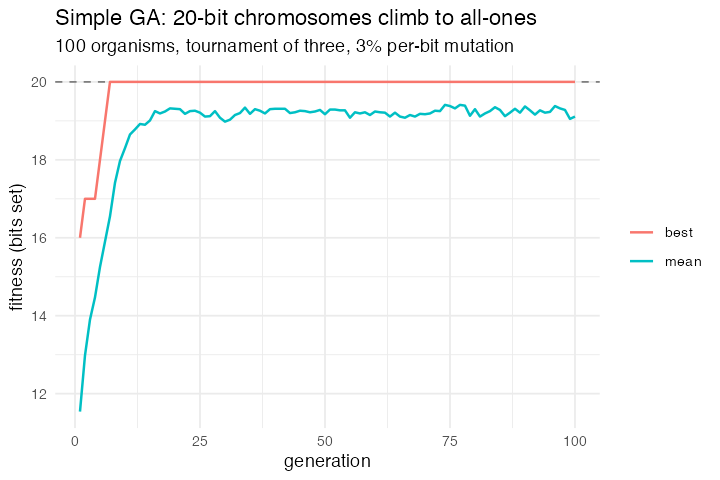

# 35. Simple Genetic Algorithm (Wilensky 1998, NetLogo Computer Science)

**Concept**

- Setup: a population of random bit strings
- Go: fitness is the number of ones; two parents are chosen by a tournament of
  three; single-point crossover with probability `crossover-rate`, otherwise a
  clone; then each bit mutates with probability `mutation-rate`
- Output: the population climbs to all-ones, unless mutation is high enough to
  destroy the answer faster than selection finds it

**Package**

The chromosome is one list column, a bit vector per agent, the way model 41
holds a strategy table. Crossover then says what it means: take the first
`cross` bits from one parent and the rest from the other.

```r
L <- 20; N <- 100                      # 20 bits, 100 individuals
mutation <- 0.03; crossover <- 0.7

pop <- abm_setup(
  agents  = abm_agents(n = N, genome = ~lapply(seq_len(n), function(i)
                                          sample(0:1, L, replace = TRUE))),
  globals = list(mut = mutation, xover = crossover, L = L),
  seed    = 1)

fitness_rule <- abm_rules(fitness ~ vapply(genome, sum, numeric(1)))

tournament <- function(out) list(
  abm_rules(t1 ~ sample(n(), n(), replace = TRUE),
            t2 ~ sample(n(), n(), replace = TRUE),
            t3 ~ sample(n(), n(), replace = TRUE)),
  abm_rules(new_formula(sym(out), expr(
    if_else(fitness[t1] >= fitness[t2] & fitness[t1] >= fitness[t3], t1,
            if_else(fitness[t2] >= fitness[t3], t2, t3)))))
)

go <- do.call(abm_go, c(
  list(fitness_rule),
  tournament("p1"), tournament("p2"),
  list(abm_rules(cross  ~ sample(L, n(), replace = TRUE),
                 sexual ~ runif(n()) < xover)),
  # genome[p1] and genome[p2] are the parents' genomes, so the whole generation
  # is bred in one rule and every child reads the *old* one.
  list(abm_rules(genome ~ Map(
    function(g1, g2, s, k) if (!s) g1 else c(g1[seq_len(k)], g2[-seq_len(k)]),
    genome[p1], genome[p2], sexual, cross))),
  list(abm_rules(genome ~ lapply(genome, function(g)
    if_else(runif(L) < mut, 1L - g, g)))),
  list(fitness_rule)
))

result <- abm_run(pop, go, ticks = 100, seed = 1)
```

**Result.** 20 bits, 100 individuals, 100 generations. With mutation 0.03 the
optimum (fitness 20) is first reached at **generation 8** and held thereafter.
Across mutation rates:

| mutation | 0.01 | 0.03 | 0.10 | 0.30 |
|---|---|---|---|---|
| best | 20 | 20 | 20 | 16 |
| mean | 19.7 | 19.1 | 15.2 | 10.8 |

The error catastrophe, at the rate the NetLogo model puts it. The mean is where
it shows: at 0.10 there is still an all-ones individual in the last generation
and the population sits five bits below it, and at 0.30 nothing reaches the
optimum at all.

*Needed nothing new.* It was filed as the third model to hit the same wall as El
Farol's weights and PD N-Person's memory, a vector of per-agent state with only
scalar columns to put it in. That wall was not there: model 41 holds its
strategy table in a list column, and a 20-bit genome fits in one too. The genome
was `L` columns, bred by `L` generated rules and mutated by `L` more, and the
crossover rule was the argument for keeping it that way, since the parent
switches part-way along the chromosome. That argument was backwards. Spread
across columns, crossover is `L` rules each comparing its own fixed index to
`cross`; as a vector it is `c(g1[seq_len(k)], g2[-seq_len(k)])`, which is the
definition. The script runs 3× faster and the numbers above are not the old ones,
because the mutation draws now come per agent rather than per bit and the
random stream is therefore different.

*What did still work cleanly, and is why `L` is no longer in the shape of the
model: formula objects built with `rlang::new_formula()` go straight into
`abm_rules()` and `do.call(abm_go, ...)`. Only the tournament needs it now, and
only because the target column is computed.*

**Replication**



**Reproduce:** [`35-simple-genetic-algorithm.R`](scripts/35-simple-genetic-algorithm.R)

---

← [34. epiDEM Basic](34-epidem-basic.md) · [all models](README.md) · [36. Information cascade](36-information-cascade.md) →
