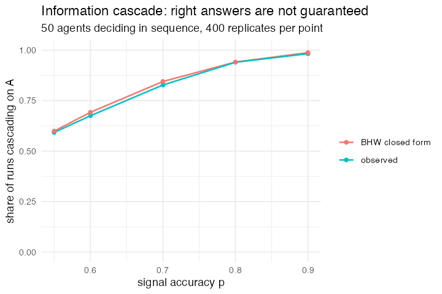

# 36. Information cascade (Bikhchandani, Hirshleifer & Welch 1992)

**Concept**

- Setup: an unknown true state, and agents each holding a private signal that is
  right with probability `p`
- Go: agents decide **one at a time**, seeing every predecessor's decision but
  none of their signals. Follow your own signal unless the public tally already
  leads by two, in which case follow the crowd
- Output: once two decisions agree, everybody afterwards copies, and the herd is
  wrong a fixed fraction of the time no matter how many agents there are

**Package**

```r
side <- function(signal, nA, nB) {
  d <- nA - nB
  if_else(d >= 2, "A", if_else(d <= -2, "B", signal))
}

pop <- abm_setup(
  agents  = abm_agents(n = 50,
                       signal = ~if_else(runif(n) < p, "A", "B"),
                       decision = NA_character_),
  globals = list(nA = 0, nB = 0),
  seed    = seed
)

go <- abm_go(
  abm_sequential(
    decision ~ side(signal, nA, nB),
    nA ~ nA + (side(signal, nA, nB) == "A"),
    nB ~ nB + (side(signal, nA, nB) == "B")
  )
)

result <- abm_run(pop, go, ticks = 1, seed = seed)
```

**Result.** 400 runs at each signal accuracy, share of runs ending in a correct
cascade against the closed form `p² / (p² + (1-p)²)`:

| `p` | 0.55 | 0.60 | 0.70 | 0.80 | 0.90 |
|---|---|---|---|---|---|
| simulated | 0.593 | 0.675 | 0.828 | 0.940 | 0.983 |
| analytic | 0.599 | 0.692 | 0.845 | 0.941 | 0.988 |

Five for five within sampling error. Alongside Hawks and Doves, this is the
tightest quantitative validation in the corpus.

*Needed nothing new, and it is the clearest test of `abm_sequential()` so far.*
The public tally is a global that each agent reads and then adds to, which is
exactly the depletion semantics the step exists for. It also found the step's
sharpest edge, which Part 5 then fixed: rules inside one `abm_sequential()` step
used to be simultaneous within the agent, so `nA ~ nA + (decision == "A")` would
read the *previous* decision, and the choice had to be recomputed, hence
`side()` appearing three times. Rules now cascade, so the natural form works.
The three-call version above is left as written because it is what the run in the
table used and because it is still correct. The point is that it no longer has
to be written that way.

**Replication**



**Reproduce:** [`36-information-cascade.R`](scripts/36-information-cascade.R)

---

← [35. Simple Genetic Algorithm](35-simple-genetic-algorithm.md) · [all models](README.md) · [37. Virus on a Network](37-virus-on-a-network.md) →
