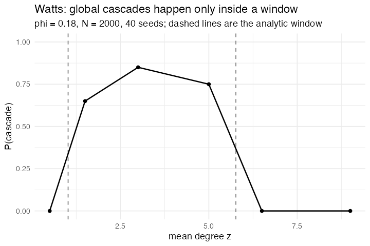

# 38. Global cascades on random networks (Watts 2002)

**Concept**

- Setup: 2000 agents on an Erdős–Rényi graph of mean degree `z`, all off,
  every agent holding the same fractional threshold φ = 0.18
- Go: an agent switches on when at least φ of its neighbours are on
- Perturbation: one agent, switched on at t = 0
- Output: whether that single agent takes the whole network with it

**Package**

```r
cascade_run <- function(z, phi = 0.18, n = 2000, seed = 1, ticks = 60) {
  m <- abm_setup(
    agents  = abm_agents(n = n, on = ~seq_len(n) == 1L, share = 0),
    network = abm_network(type = "poisson", degree = z),
    seed    = seed
  )
  go <- abm_go(
    abm_neighbours(share ~ mean(on)),
    abm_rules(on ~ on | coalesce(share, 0) >= phi),
    abm_global(active ~ mean(on))
  )
  g <- abm_globals(abm_run(m, go, ticks = ticks, seed = seed))
  g$active[nrow(g)]
}
```

**Result**

Watts's cascade condition is `sum_k k(k-1) rho_k p_k = z` with
`rho_k = 1[1/k >= phi]`, which for φ = 0.18 and a Poisson degree distribution
has roots at **z = 1.021 and z = 5.765**. Outside those two numbers a single
seed should never spread. Inside them it often should.

| z | P(cascade), 40 seeds | inside the window? |
|---|---|---|
| 0.5 | 0.00 | no |
| 1.5 | 0.65 | yes |
| 3.0 | 0.85 | yes |
| 5.0 | 0.75 | yes |
| 6.5 | 0.00 | no |
| 9.0 | 0.00 | no |

Both boundaries are sharp, and the reason for each is different. Below `z = 1`
the graph has no giant component and the seed is stuck in a small island. Above
`z = 5.8` the graph is perfectly well connected and the cascade cannot *start*:
every agent has so many neighbours that one of them is never 18% of them.
Robustness and fragility are the same property looked at from two sides.

*Needed `abm_network(type = "poisson")`, and the model is the argument for it.
On the k-regular graph that `type = "random"` builds, no cascade ever starts
once k > 1/φ, because every agent is identical and none of them is vulnerable.
The whole phenomenon lives in the low-degree tail of the degree distribution,
among the agents with three neighbours in a graph averaging five, and a regular
graph does not have one. It is the clearest case in the corpus of the network
generator being part of the model rather than part of the setup.*

**Replication**



**Reproduce:** [`38-global-cascades-on-random-networks.R`](scripts/38-global-cascades-on-random-networks.R)

---

← [37. Virus on a Network](37-virus-on-a-network.md) · [all models](README.md) · [39. Sznajd model](39-sznajd-model.md) →
