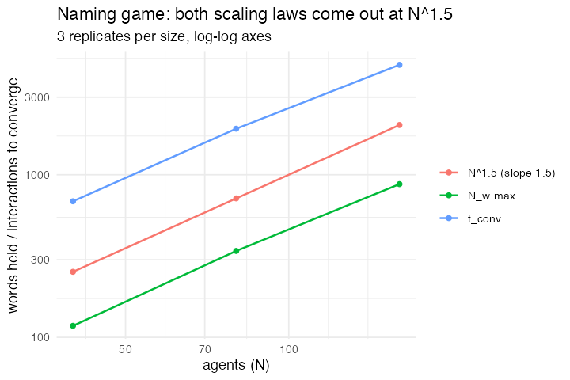

# 40. Naming Game (Baronchelli, Felici, Loreto, Caglioti & Steels 2006)

**Concept**

- Setup: N agents, each with an empty inventory of names for one object
- Go: a speaker and a hearer meet. The speaker utters a name from its
  inventory, inventing one if it is empty. If the hearer already knows that
  name the negotiation succeeds and **both** agents throw away everything else,
  keeping only that name; if it does not, the hearer adds it and both keep
  what they had.
- Output: with no central authority and no memory of who said what, the whole
  population converges on a single shared name

**Package**

```r
naming_game <- function(n = 100, ticks = 6000, seed = 1) {
  m <- abm_setup(
    agents = abm_agents(
      n         = n,
      inventory = ~vector("list", n),   # everyone starts knowing nothing
      utterance = NA_integer_
    ),
    seed = seed
  )

  go <- abm_go(
    abm_match(pair = "random", role = list(speaker = TRUE, hearer = TRUE)),

    abm_rules(utterance ~ {
      s <- which(.role == "speaker")[[1]]
      inv <- inventory[[s]]
      rep(if (length(inv)) inv[sample.int(length(inv), 1L)]
          else .id[[s]] * 1000000L + sum(lengths(inventory)) + 1L,
          n())
    }),

    abm_rules(inventory ~ {
      u <- utterance[[1]]
      h <- which(.role == "hearer")[[1]]
      if (u %in% inventory[[h]]) {
        rep(list(u), n())
      } else {
        out <- inventory
        out[[h]] <- c(out[[h]], u)
        out
      }
    }),

    abm_global(words          ~ sum(lengths(inventory)),
               distinct_names ~ length(unique(unlist(inventory))),
               known          ~ mean(lengths(inventory) > 0))
  )

  abm_globals(abm_run(m, go, ticks = ticks, seed = seed))
}
```

**Result** (3 runs at each size, 30N ticks)

| N | peak total names held | interactions to convergence | / N^1.5 |
|---|---|---|---|
| 40 | 118 | 687 | 2.71 |
| 80 | 340 | 1920 | 2.68 |
| 160 | 876 | 4747 | 2.35 |

Fitted exponents: peak names ~ N^**1.45**, convergence ~ N^**1.39**. Baronchelli
et al. report 3/2 for both, and three sizes with three runs each is enough to
show the exponent is nearer 1.5 than 1 or 2 and not much more than that, the
shortfall is the usual finite-size drag at small N.

The shape of the run is the point: the population first invents *far more* names
than there are agents, floundering, and only then collapses to one. Disorder
peaks before order arrives.

*Needed nothing new, which was the surprise. "No set-valued agent state" has
been the first entry under Open items since Part 3, and it turns out to have
been a documentation gap rather than a code one: `abm_agents()` takes a list
column, an `abm_rules()` right-hand side may return one, `partner_<col>` works
for a list column, and the snapshot machinery carries it through. What the
model does need is for the rules to be written over lists,* `Map()` *and*
`lapply()` *where you would otherwise have written arithmetic, and for the
uttered word to be computed once per pair, which grouped evaluation inside a
match already gives you.*

*One idiom is worth naming. Inside a `size = 2` match the rule is evaluated over
a two-row group, so `which(.role == "speaker")[[1]]` picks out the speaker's row
and `rep(x, n())` broadcasts one value back to both members. That is how a rule
says "the pair agrees on this" rather than "each of them decides separately".*

**Replication**



**Reproduce:** [`40-naming-game.R`](scripts/40-naming-game.R)

---

← [39. Sznajd model](39-sznajd-model.md) · [all models](README.md) · [41. Minority Game](41-minority-game.md) →
