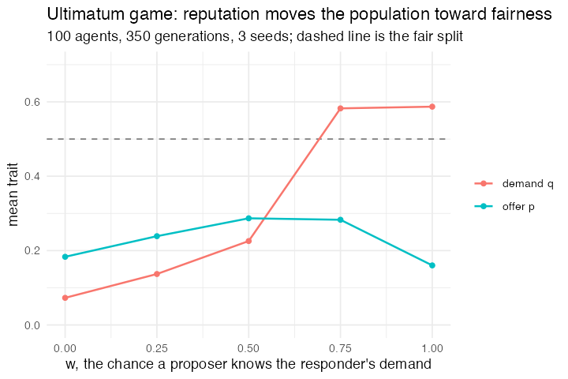

# 44. Fairness versus reason in the ultimatum game (Nowak, Page & Sigmund 2000)

**Concept**

- Setup: 100 agents, each with a strategy (p, q), offer p when proposing,
  accept nothing below q when responding
- Go: random pairs, one proposing and one responding, eight rounds a
  generation. With probability `w` the proposer knows this responder's demand
  and offers just enough to clear it; otherwise it offers its own p. An offer
  at or above q is accepted and splits the unit; below it, neither gets
  anything.
- Reproduction: proportional to payoff, with a small mutation on both traits
- Output: where (p, q) settles, as a function of `w`

Reason says offer nothing and accept anything. People offer about a half. Nowak,
Page & Sigmund's answer is reputation: if what you have been demanding gets
around, demanding a lot stops being merely a way to get rejected and becomes a
way to attract better offers.

**Package**

```r
w <- 1; rounds <- 8; mu <- 0.005

m <- abm_setup(
  agents = abm_agents(n = 100, p = ~runif(n, 0, 0.5), q = ~runif(n, 0, 0.5),
                      payoff = 0, pick = 1L),
  seed   = 1)

play <- list(
  abm_match(pair = "random", role = list(proposer = TRUE, responder = TRUE)),
  abm_rules(payoff ~ {
    pr <- which(.role == "proposer")[[1]]
    re <- which(.role == "responder")[[1]]
    informed <- runif(1) < w
    offer <- if (informed && q[[re]] > p[[pr]] && q[[re]] < 1) q[[re]] else p[[pr]]
    out <- payoff
    if (offer >= q[[re]]) {
      out[[pr]] <- out[[pr]] + (1 - offer)
      out[[re]] <- out[[re]] + offer
    }
    out
  })
)

go <- do.call(abm_go, c(
  rep(play, rounds),
  list(
    abm_global(mean_p ~ mean(p), mean_q ~ mean(q)),
    # reproduction proportional to payoff: the index is drawn once...
    abm_rules(pick ~ sample(n(), n(), replace = TRUE, prob = payoff + 1e-9),
              .scope = "population"),
    # ...and both traits of the surviving genome travel by it
    abm_rules(p ~ p[pick] + runif(n(), -mu, mu),
              q ~ q[pick] + runif(n(), -mu, mu), .scope = "population"),
    abm_rules(p ~ pmax(0, pmin(1, p)), q ~ pmax(0, pmin(1, q)),
              .scope = "population"),
    abm_rules(p ~ pmin(p, 1 - q), .scope = "population"),
    abm_rules(payoff ~ 0, .scope = "population")
  )
))

result <- abm_run(m, go, ticks = 350, seed = 1)
```

**Result** (3 runs each, 350 generations, mean over the last 50)

| w | mean p | mean q |
|---|---|---|
| 0.00 | 0.183 | 0.073 |
| 0.25 | 0.239 | 0.137 |
| 0.50 | **0.287** | **0.226** |
| 0.75 | 0.283 | 0.582 |
| 1.00 | 0.160 | 0.587 |

With no information the population heads for the rational solution S(0, 0), with
q already at 0.07 and still falling. Information moves it towards fairness,
and at w = 0.5 both traits are up with q a little below p, which is the shape
Nowak, Page & Sigmund report.

At w = 1 this implementation degenerates, and it is worth being clear about why
rather than quoting only the two columns that work. The information rule here is
that an informed proposer offers exactly the responder's demand. When *every*
proposer is informed, p is never the offer anybody actually makes, so selection
stops acting on it at all and it drifts down while q runs away upwards. The
paper's fair fixed point needs the uninformed encounters to keep p under
selection, and the run bears that out: p peaks at intermediate w and falls
away on either side.

*Needed nothing new. It is the "draw the index once" idiom from Part 4 doing the
work, a genome with two traits cannot be resampled with two independent
`sample()` calls, or p and q get shuffled apart and the population inherits
combinations that never existed. The index is drawn in a step of its own and both
traits are indexed by it. What it adds to that idiom is the composition trick:
`rep(play, rounds)` inside `do.call(abm_go, ...)` turns "eight rounds a
generation" into a parameter rather than eight copies of two lines.*

**Replication**



**Reproduce:** [`44-ultimatum-game.R`](scripts/44-ultimatum-game.R)

---

← [43. Zero-intelligence traders in a double auction](43-zero-intelligence-traders.md) · [all models](README.md) · [45. Hotelling's Law](45-hotellings-law.md) →
