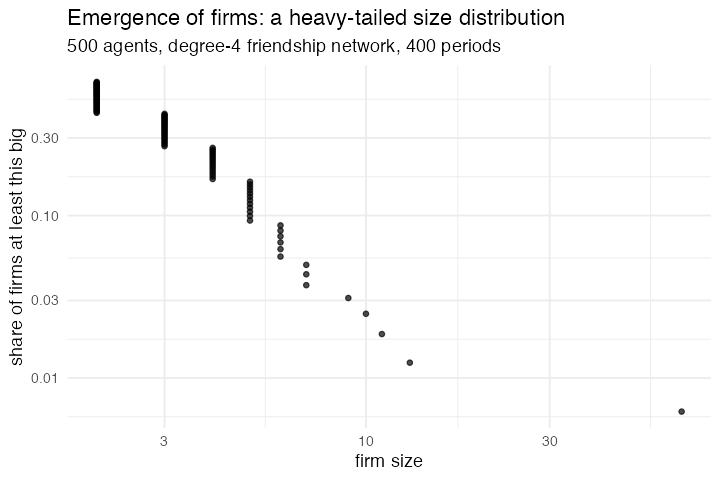

# 49. The emergence of firms in a population of agents (Axtell 1999)

**Concept**

- Setup: 500 agents, each with a taste `θ` for income against leisure and a
  friendship network; everyone starts as a firm of one
- Go: a tenth of the agents are activated each period; an activated agent
  compares the utility of staying in its firm at its best effort, of joining a
  friend's firm, and of striking out alone, and takes the best
- Output: the distribution of firm sizes, and how long any of them lasts

**Package**

```r
m <- abm_setup(
  agents  = abm_agents(n = 500, theta = ~runif(n), effort = 0.2,
                       firm = ~seq_len(n), E = 0, sz = 1,
                       u_stay = 0, u_move = 0, u_solo = 0),
  network = abm_network(type = "random", degree = 4),
  seed    = 1)

go <- abm_go(
  # the one aggregate this model is made of: what my firm produces, and how
  # many of us there are to share it
  abm_rules(E ~ sum(effort), sz ~ n(), .by = firm),
  abm_match(pair = "network", eligible = runif(n()) < active),
  abm_rules(
    u_stay ~ best(E - effort, sz,                theta)$u,
    u_solo ~ best(0,          1,                 theta)$u,
    u_move ~ if_else(is.na(.partner), -Inf,
                     best(partner_E, partner_sz + 1, theta)$u),
    .scope = "population"),
  abm_rules(
    firm ~ case_when(is.na(.partner)                     ~ firm,
                     u_move >= u_stay & u_move >= u_solo ~ partner_firm,
                     u_solo >= u_stay                    ~ .id,
                     TRUE                                ~ firm),
    .scope = "population"),
  abm_rules(E2 ~ sum(effort) - effort, sz2 ~ n(), .by = firm),
  abm_rules(effort ~ if_else(is.na(.partner), effort, best(E2, sz2, theta)$e),
            .scope = "population")
)

result <- abm_run(m, go, ticks = 400, seed = 1)
```

Output is `a·E + b·E²` in the firm's total effort `E`, so returns increase.
Compensation is an equal share, and utility is `(O/n)^θ · (ω − e)^(1−θ)`.

**Result** (500 agents, degree-4 friendship network, 400 periods, 5 seeds)

| firms | mean size | biggest | mean effort | ccdf slope |
|---|---|---|---|---|
| 159 | 3.16 | 32 | 0.320 | 1.76 |

| snapshot | biggest firm | its size | firms |
|---|---|---|---|
| t = 80 | 384 | 15 | 166 |
| t = 160 | 411 | 22 | 160 |
| t = 240 | 21 | 17 | 150 |
| t = 320 | 293 | 9 | 168 |
| t = 400 | 230 | 66 | 161 |

Nobody in this model wants a firm. Each agent is maximising its own utility
over its own effort, and the only reason to be in a company at all is that
output rises faster than linearly in total effort, so joining someone makes the
pot bigger. That is enough: a population that starts as five hundred
one-person firms settles at about a hundred and sixty, most of them tiny and a
few of them large, with a size distribution whose upper tail is close to a
power law. The number of firms is stable and their identities are not, the
largest firm at each snapshot is a different firm, and it is a different size
each time. Firms in this model have life cycles, and the aggregate is steady
while every part of it is churning.

The mechanism behind the churn is the free-rider problem, which is *why* the
model is written this way. Equal shares mean a big firm's marginal product is
diluted across its members, so the best response inside a large firm is to work
less. The firm grows because joining is attractive, and then collapses because
being in it is not. It is the model's central claim that this is what firm
turnover *is*, and it falls out of three utility comparisons.

*Forced `.by =`. The whole model is one aggregate, my firm's total effort and
how many of us share it, and a firm is not something the grammar had. Agent
groups are fixed at setup, a match group lasts one step, and a network
neighbourhood is not a partition. `abm_rules(E ~ sum(effort), sz ~ n(), .by =
firm)` evaluates once per distinct value of an ordinary agent column and writes
the answer back to every member. That the column is ordinary is the point: an
agent that writes a new value into `firm` has changed which group it is in, and
the next step sees the new one. It is the only grouping in the grammar the
agents themselves control, and teams, households, cohorts and coalitions all
want it.*

*It could have been written without the addition.
`E ~ ave(effort, firm, FUN = sum)` inside a population-scope rule does the same
thing, in the same way Hegselmann–Krause (29) can be written with a
hand-rolled `vapply()`. The test the corpus uses is whether the model reads as
a specification afterwards, and `ave()` fails it: the grouping disappears into
a function argument instead of being the shape of the step.*

*The ccdf slope of 1.76 is steeper than the Zipf exponent near 1 that US firm
data show, and 500 agents is far too few for the tail to be measured properly.
What the number is doing here is confirming a heavy tail, not matching one.*

**Replication**



**Reproduce:** [`49-emergence-of-firms.R`](scripts/49-emergence-of-firms.R)

---

← [48. A garbage can model of organizational choice](48-garbage-can-model.md) · [all models](README.md) · [50. Adaptation on a rugged landscape](50-rugged-landscapes.md) →
