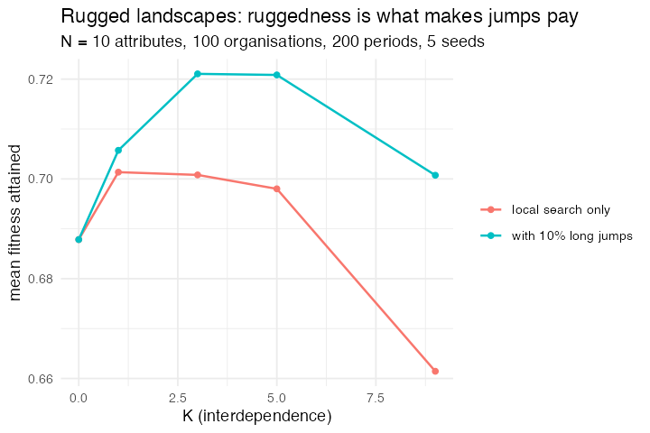

# 50. Adaptation on a rugged landscape (Kauffman 1993; Levinthal 1997)

**Concept**

- Setup: 100 organisations, each a string of 10 binary attributes; an NK
  landscape in which each attribute's contribution to fitness depends on itself
  and on K others
- Go: each organisation tries a variant of itself, a single attribute flipped,
  or with probability `jump` an entirely new string, and adopts it if it is
  fitter
- Output: what fitness local search reaches, and how many distinct forms
  survive

**Package**

```r
N <- 10; jump <- 0.1                       # 10 bits, occasional long jump

m <- abm_setup(
  agents = abm_agents(
    n    = 100,
    form = ~lapply(seq_len(n), function(i) as.integer(runif(N) < 0.5))),
  seed   = 1)

go <- abm_go(
  abm_rules(
    trial ~ lapply(form, function(v) {
      if (runif(1) < jump) as.integer(runif(N) < 0.5)
      else { i <- sample(N, 1); v[i] <- 1L - v[i]; v }
    }),
    .scope = "population"),
  abm_rules(
    form ~ Map(function(a, b) if (fit1(b, nk) > fit1(a, nk)) b else a,
               form, trial),
    .scope = "population")
)

result <- abm_run(m, go, ticks = 200, seed = 1)
```

**Result** (N = 10, 100 organisations, 200 periods of search, 5 seeds)

| K | fitness | distinct forms | fitness with long jumps | distinct forms |
|---|---|---|---|---|
| 0 | 0.688 | 1.0 | 0.688 | 1.0 |
| 1 | 0.701 | 2.8 | 0.706 | 2.8 |
| 3 | 0.701 | 14.4 | 0.721 | 11.8 |
| 5 | 0.698 | 28.6 | 0.721 | 23.0 |
| 9 | 0.661 | 55.4 | 0.701 | 41.2 |

The first column of numbers is Levinthal's point about form. With no
interaction between attributes there is one peak, and a hundred organisations
searching independently all end up as the same organisation. Turn the
interaction up and the landscape breaks into peaks. At K = 9 the same hundred
organisations end up as fifty-five different ones, each sitting on a local
optimum it cannot leave by changing one thing at a time. Diversity of
organisational form here is not a difference in what the organisations want or
what they know. It is a fossil record of where each of them started.

Long jumps are the second half of the argument. They raise average fitness at
every level of interdependence (0.661 to 0.701 at K = 9) and *reduce* the
number of surviving forms, because an organisation that occasionally looks
somewhere entirely different is not held by the first peak it happens to find.
The gain is largest exactly where the landscape is roughest, which is the case
for radical search being worth most in the industries where nothing can be
changed on its own.

*Needed no package change, and turned up a bug that did. The landscape, a
10 × 2^(K+1) table of draws, is the natural thing to hold as a global, and
`abm_setup(globals = list(nk = ...))` accepted one, but `abm_globals()` then
logged one row per matrix row per tick and quietly corrupted the tick column.
Globals were assumed to be scalars because the log is a tibble with one row per
tick. They are now list-columned when they are not, so a lookup table, a
payoff matrix or a vector of prices can live where it belongs. The model as
written keeps the landscape in the enclosing environment, which is also fine
and is what a closure is for.*

*The list column carries a genome without any ceremony, which is the finding
Part 5 recorded and this model confirms at a larger size: `form` is a list of
integer vectors, `trial` is another, and both rules are `lapply()` and `Map()`
where an ordinary model would write arithmetic.*

**Replication**



**Reproduce:** [`50-rugged-landscapes.R`](scripts/50-rugged-landscapes.R)

---

← [49. The emergence of firms](49-emergence-of-firms.md) · [all models](README.md) · [51. Imitation dynamics of vaccination](51-vaccination-imitation.md) →
