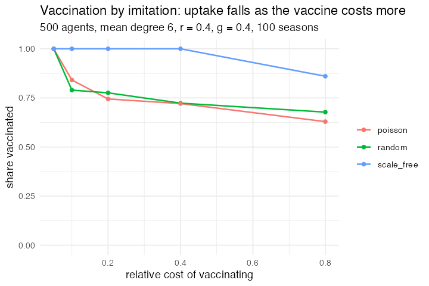

# 51. Imitation dynamics of vaccination behaviour (Fu, Rosenbloom, Wang & Nowak 2011)

**Concept**

- Setup: 500 people on a social network, half of them willing to vaccinate
- Go: each season the vaccinated are immune and pay a cost `c`, a few others
  are seeded with the disease, and the epidemic runs to the end; then everyone
  compares payoffs with a random neighbour and copies it with a Fermi
  probability
- Output: vaccination coverage and how many people got ill, as the cost of
  vaccinating rises

**Package**

```r
r <- 0.4; g <- 0.4; beta <- 10; cost <- 0.2; i0 <- 5

m <- abm_setup(
  agents  = abm_agents(n = 500, vax = ~runif(n) < 0.5, state = "S",
                       payoff = 0, infected = FALSE),
  network = abm_network(type = "random", degree = 6),
  seed    = 1)

go <- abm_go(
  abm_rules(state ~ if_else(vax, "V", "S"), infected ~ FALSE, .scope = "population"),
  abm_rules(state ~ { s <- state; k <- which(s == "S")
                      if (length(k)) s[sample(k, min(i0, length(k)))] <- "I"; s },
            .scope = "population"),

  # the epidemic runs to the end before anyone reconsiders
  abm_repeat(
    abm_neighbours(exposure ~ sum(state == "I")),
    abm_rules(state ~ case_when(
      state == "S" & runif(n()) < 1 - (1 - r)^coalesce(exposure, 0L) ~ "E",
      state == "I" & runif(n()) < g ~ "R",
      TRUE ~ state), .scope = "population"),
    abm_rules(state ~ if_else(state == "E", "I", state),
              infected ~ infected | state %in% c("I", "R"), .scope = "population"),
    until = sum(state == "I") == 0,
    max = 5000
  ),

  abm_rules(payoff ~ if_else(vax, -cost, if_else(infected, -1, 0)), .scope = "population"),
  abm_match(pair = "network"),
  abm_rules(vax ~ if_else(!is.na(.partner) &
                          runif(1) < 1 / (1 + exp(-beta * (partner_payoff - payoff))),
                          partner_vax, vax))
)

result <- abm_run(m, go, ticks = 100, seed = 1)
```

**Result** (N = 500, mean degree 6, r = 0.4, g = 0.4, β = 10, 2 seeds, 100 seasons)

| network | cost | vaccinated | infected |
|---|---|---|---|
| regular | 0.05 | 1.000 | 0.000 |
| regular | 0.10 | 0.790 | 0.032 |
| regular | 0.20 | 0.776 | 0.049 |
| regular | 0.40 | 0.723 | 0.073 |
| regular | 0.80 | 0.678 | 0.114 |
| Poisson | 0.05 | 0.999 | 0.000 |
| Poisson | 0.10 | 0.841 | 0.020 |
| Poisson | 0.20 | 0.745 | 0.052 |
| Poisson | 0.40 | 0.721 | 0.071 |
| Poisson | 0.80 | 0.629 | 0.127 |
| scale-free | 0.05 | 1.000 | 0.000 |
| scale-free | 0.10 | 1.000 | 0.000 |
| scale-free | 0.20 | 1.000 | 0.000 |
| scale-free | 0.40 | 1.000 | 0.000 |
| scale-free | 0.80 | 0.860 | 0.026 |

Coverage falls and the epidemic grows as vaccinating gets dearer, which is the
free-rider problem stated as a table: an unvaccinated person surrounded by
vaccinated ones pays nothing and catches nothing, so the population cannot hold
full coverage once the cost is real. The interesting column is the network.
On a scale-free graph coverage stays at 100% up to a cost eight times what
breaks the regular graph, and even at c = 0.8 it is a quarter higher.

The reason is that on a heterogeneous graph the hubs are both the most exposed
and the most copied. A hub that skips the vaccine is very likely to catch the
disease, its payoff is visibly bad, and a large number of neighbours are
watching. Degree does two jobs at once, it decides who gets infected and it
decides whose behaviour spreads, and they point the same way. On a regular
graph nobody is either.

*Forced `abm_repeat()`. A season has two timescales in it: an epidemic that
runs for as long as it runs, and one round of social learning afterwards. The
grammar had one loop, the tick, and the only way to write an inner phase was to
repeat the steps a fixed number of times with `rep()`, which means either
guessing an upper bound and paying for it every season, or cutting the epidemic
off mid-course and reporting a payoff that has not happened yet.
`abm_repeat(..., until = sum(state == "I") == 0, max = 5000)` says the thing
the model says. It is also the answer to the "no early stopping" entry on the
Open items list, from the other end: a block wrapped in `abm_repeat()` and run
for a single tick stops when the model reaches its absorbing state.*

*A push is a pull here, as it was for Virus on a Network (37): a susceptible
node with `k` infected neighbours is infected with probability `1 - (1 - r)^k`,
which `abm_neighbours()` computes without any outward write. `abm_tell()` is
for transmission that depends on the sender.*

*The `"E"` state is not epidemiology. `abm_rules()` is simultaneous, so
without it the agents infected in a pass would infect their own neighbours in
the same pass. A one-step holding state and a second rule promoting it is how
you say "these become infectious next round" in a synchronous update.*

**Replication**



**Reproduce:** [`51-vaccination-imitation.R`](scripts/51-vaccination-imitation.R)

---

← [50. Adaptation on a rugged landscape](50-rugged-landscapes.md) · [all models](README.md) · [52. Bank runs and the sequential service constraint](52-bank-runs.md) →
