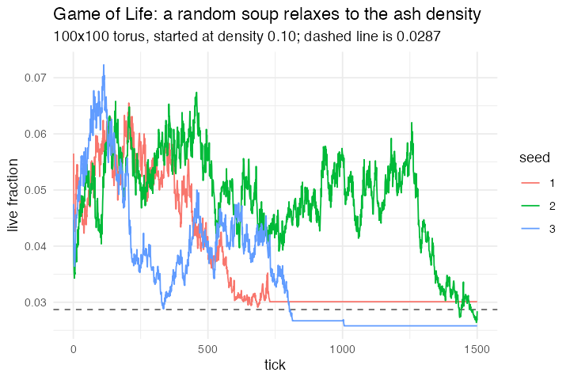

# 1. Conway's Game of Life (Life Simple, NetLogo Models Library, Wilensky 1998)

**Concept**

- Setup: a grid of patches, each alive or dead, Moore-8 neighbourhood on a torus
- Go: count the live neighbours, then apply the birth/survival rule to everyone
  at once
- Output: blinkers blink, gliders glide, and a random soup settles to a thin
  scatter of still lifes and oscillators

**Package**

```r
life <- abm_setup(
  agents  = abm_agents(alive = ~runif(n) < 0.10),
  network = abm_network(type = "grid", dims = c(100, 100)))

go <- abm_go(
  abm_neighbours(live_n ~ sum(alive)),
  abm_rules(alive ~ live_n == 3 | (alive & live_n == 2)),
  abm_global(density ~ mean(alive))
)

result <- abm_run(life, go, ticks = 1500, seed = 1, record = "globals")
```

*L0, and nothing else. `abm_neighbours()` is the first `ask patches` and
`abm_rules()` is the second, and `abm_rules()`'s simultaneity **is** the
two-`ask` structure — the synchronous update cannot be written wrongly here.
The lattice is an ordinary network: `abm_network(type = "grid")` produces the
same `from`/`to` edge tibble a random graph does, patches are ordinary agents,
and `abm_agents()` takes no `n =` because the grid says how many there are.*

**Replication**

The blinker returns to its starting cells every 2 ticks. The glider's centroid
gains exactly (+1, −1) every 4 ticks — one cell diagonally per period, which is
the known velocity. A 100×100 random soup started at density 0.10 relaxes to
0.0281 by tick 1500, against a published ash density of about 0.0287.



**Reproduce:** [`01-life.R`](scripts/01-life.R)

---

[all spatial models](README.md) · [2. Elementary 1-D CA](02-ca1d.md) →
