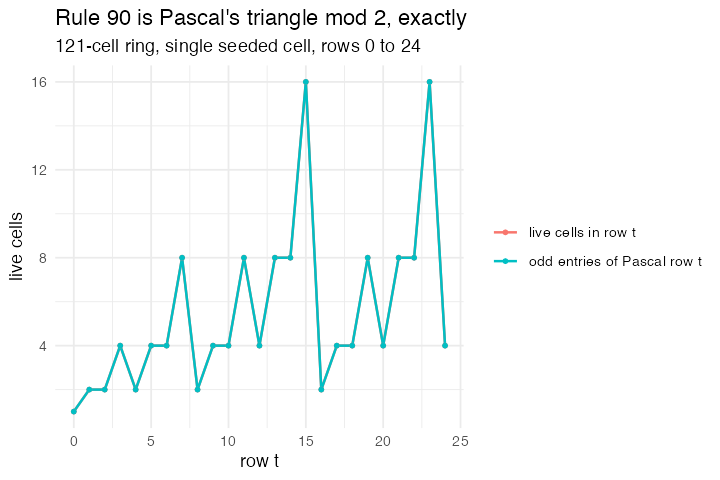

# 2. Elementary 1-D cellular automaton, rule 90 (CA 1D Elementary, Wilensky 1998)

**Concept**

- Setup: a ring of 121 cells, one of them set, and the rule number held as a
  global 8-bit vector
- Go: read the *ordered* triple (left, self, right) and look the outcome up in
  the rule table
- Output: rule 90 draws Sierpinski's triangle; rule 30 produces a centre column
  used as a random-number source

**Package**

```r
ca <- abm_setup(
  agents  = abm_agents(s = ~as.integer(seq_len(n) == n %/% 2 + 1)),
  network = abm_network(type = "line", dims = 121, torus = TRUE),
  globals = list(rule = as.integer(intToBits(90))[1:8]))

go <- abm_go(
  abm_neighbours(s_l ~ sum(s), .where = "west"),
  abm_neighbours(s_r ~ sum(s), .where = "east"),
  # note `rule[i]`, not `rule[[i]]`: `[[` does not vectorise over a population
  abm_rules(s ~ rule[4 * s_l + 2 * s + s_r + 1])
)

result <- abm_run(ca, go, ticks = 24, seed = 1)
```

*The one model that needs **L1**. Every other lattice model treats a
neighbourhood as a set; this one needs the two neighbours told apart, because
(1, 0, 0) and (0, 0, 1) are different rows of the rule table.
`abm_neighbours(.where = "west")` is what picks a named direction out of the
grid's edges, and it is the reason the grid constructor records which way each
edge points at all.*

*One correction to the design probe's sketch, and it is the grammar behaving as
documented rather than a gap: `rule[[i]]` must be `rule[i]`, because `[[` does
not vectorise over a population of more than one.*

**Replication**

Row *t* of the space-time diagram equals `choose(t, 0:t) %% 2` exactly, for
every *t* from 0 to 24 — not approximately, cell for cell. The figure is that
check: the number of live cells in row *t* against the number of odd binomial
coefficients in Pascal's row *t*.



**Reproduce:** [`02-ca1d.R`](scripts/02-ca1d.R)

---

← [1. Conway's Game of Life](01-life.md) · [all spatial models](README.md) · [3. Forest Fire](03-fire.md) →
