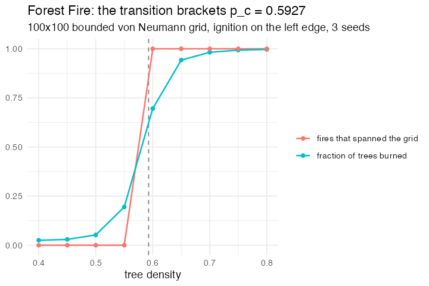

# 3. Forest Fire (Fire, NetLogo Models Library, Wilensky 1997)

**Concept**

- Setup: a 100×100 bounded grid, each cell a tree with probability *density*
- Go: light the left edge, then let the front spread to von Neumann neighbours
  until it goes out
- Output: a percolation transition — below a critical density the fire dies near
  the edge, above it the fire crosses the whole grid

**Package**

```r
fire <- abm_setup(
  agents  = abm_agents(state = ~if_else(runif(n) < density, "tree", "empty")),
  network = abm_network(type = "grid", dims = c(100, 100),
                        diagonals = FALSE, torus = FALSE),
  seed = 1)

go <- abm_go(
  abm_rules(state ~ if_else(state == "tree" & .x == 1, "burning", state)),
  abm_repeat(
    abm_neighbours(hot ~ any(state == "burning")),
    abm_rules(state ~ case_when(state == "burning"    ~ "burnt",
                                state == "tree" & hot ~ "burning",
                                TRUE                  ~ state)),
    until = !any(state == "burning"),
    max   = 400)
)

result <- abm_run(fire, go, ticks = 1, seed = 1, record = "final")
```

*L0. `diagonals = FALSE` is load-bearing rather than cosmetic: it is what puts
the transition at the square-lattice **site**-percolation threshold rather than
at the Moore one, which sits near 0.41.*

*Two things about the shape of this run. Ignition is its own `abm_rules()` step,
so the start pattern is one swappable line — `.x == 1` for the left edge,
`.x == 50 & .y == 50` for a centre point — and `.x` / `.y` are engine-owned
columns the grid constructor writes. And for a density study a run is an
**experiment**, not an animation, so the spread sits inside
`abm_repeat(until = !any(state == "burning"))` and the model runs for a single
tick: one run, one completed fire, stopping the moment the front goes out
instead of grinding through a fixed tick budget.*

**Replication**

Between density 0.55 and 0.60 the burned fraction goes 0.05 → 0.70 and the
proportion of fires that reach the far edge goes 0 → 1, bracketing the
square-lattice site-percolation threshold *p*<sub>c</sub> ≈ 0.5927.



**Reproduce:** [`03-fire.R`](scripts/03-fire.R)

---

← [2. Elementary 1-D CA](02-ca1d.md) · [all spatial models](README.md) · [4. Schelling, with geography](04-schelling.md) →
