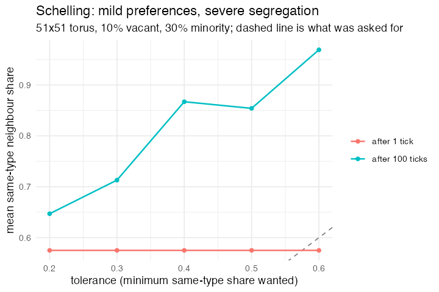

# 4. Schelling segregation, with geography (Segregation, Wilensky 1997)

**Concept**

- Setup: a 51×51 torus, 90% of cells occupied, 30% of residents a minority type
- Go: a resident who has fewer than *tolerance* same-type neighbours is unhappy
  and swaps into an empty cell
- Output: mild preferences produce severe segregation, well past what anybody
  asked for

**Package**

```r
town <- abm_setup(
  agents = abm_agents(
    occ  = ~sample(c(rep(TRUE, n_occ), rep(FALSE, n - n_occ))),
    type = ~if_else(occ, sample(c("A", "B"), n, TRUE, c(0.7, 0.3)),
                    NA_character_)),
  network = abm_network(type = "grid", dims = c(51, 51),
                        diagonals = TRUE, torus = TRUE),
  globals = list(tol = 0.30), seed = 6)

go <- abm_go(
  abm_neighbours(same ~ mean(type == own_type, na.rm = TRUE)),
  abm_rules(unhappy ~ occ & !is.na(same) & same < tol),
  abm_match(pair = "opposite_group", by = occ, eligible = unhappy | !occ),
  abm_rules(
    type ~ if_else(!occ & !is.na(partner_type), partner_type,
                   if_else(unhappy, NA_character_, type)),
    occ  ~ case_when(!occ & !is.na(partner_type) ~ TRUE,
                     unhappy ~ FALSE, TRUE ~ occ)),
  abm_global(seg ~ mean(same, na.rm = TRUE))
)

result <- abm_run(town, go, ticks = 100, seed = 6, record = "globals")
```

*L0, and the interesting part is that relocation needs no new step at all. It is
a mutual `opposite_group` match between the unhappy cells and the empty ones —
the same exclusion guarantee that stops two wolves eating one sheep is what
stops two families taking one house. The lattice never moves; a resident
relocating is a data write on two rows.*

*`own_type` inside `abm_neighbours()` is the focal agent's own value, which is
what makes "the share of my neighbours who are like me" a single expression.*

**Replication**

A randomly mixed 70/30 population already sits at 0.7² + 0.3² = 0.58 same-type
neighbours, which is the baseline the first tick measures. At a tolerance of
0.30 — asking only that three in ten neighbours match you — the settled town
reaches 0.713. Asking for more gets you far more of it than you asked for, which
is the whole Schelling point.



**Reproduce:** [`04-schelling.R`](scripts/04-schelling.R)

---

← [3. Forest Fire](03-fire.md) · [all spatial models](README.md) · [5. Wolf–Sheep–Grass](05-wolf-sheep.md) →
