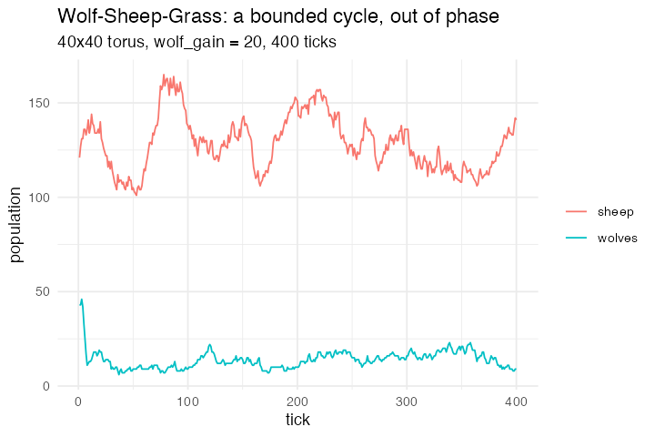

# 5. Wolf–Sheep–Grass (Wolf Sheep Predation, Wilensky 1997)

**Concept**

- Setup: a 40×40 torus of grass patches, 120 sheep and 40 wolves standing on
  them
- Go: everyone steps to a random neighbouring cell and loses energy; sheep eat
  the grass under them, wolves eat a sheep sharing their cell, both reproduce,
  the grass regrows on a timer
- Output: coexistence in a bounded cycle, with the two populations out of phase

**Package**

```r
world <- abm_setup(
  agents = list(
    patches = abm_agents(grass     = ~sample(c(TRUE, FALSE), n, TRUE),
                         countdown = ~sample.int(30, n, TRUE)),
    sheep   = abm_agents(n = 120, energy = ~runif(n, 4, 8)),
    wolves  = abm_agents(n = 40,  energy = ~runif(n, 4, 8))),
  network = abm_network(type = "grid", dims = c(40, 40), on = "patches",
                        diagonals = TRUE, torus = TRUE),
  globals = list(regrow = 30, sheep_gain = 4, wolf_gain = 20,
                 sheep_repro = 0.04, wolf_repro = 0.05),
  seed = 1)

go <- abm_go(
  abm_move(along = "patches", to = "random_neighbour", who = c("sheep", "wolves")),
  abm_rules(energy ~ energy - 1),

  # sheep eat the grass on their cell
  abm_neighbours(grass_here ~ any(grass),
                 within = .group == "patches" & .id == own_.cell),
  abm_rules(energy ~ if_else(.group == "sheep" & grass_here,
                             energy + sheep_gain, energy)),
  abm_tell(grass ~ FALSE, countdown ~ regrow, to = .cell,
           when = .group == "sheep" & grass_here),

  # wolves eat a sheep sharing their cell: one prey per predator, per cell
  abm_match(pair = "opposite_group", by = .group, .by = .cell,
            eligible = .group %in% c("wolves", "sheep")),
  abm_rules(energy ~ if_else(.group == "wolves" & !is.na(.partner),
                             energy + wolf_gain, energy)),
  abm_death(when = .group == "sheep" & !is.na(.partner)),
  abm_death(when = .group %in% c("sheep", "wolves") & energy < 0),

  abm_birth(when = .group == "sheep"  & runif(n()) < sheep_repro,
            cost = energy ~ energy / 2),
  abm_birth(when = .group == "wolves" & runif(n()) < wolf_repro,
            cost = energy ~ energy / 2),

  abm_rules(grass     ~ grass | countdown == 0,
            countdown ~ case_when(grass          ~ countdown,
                                  countdown <= 0 ~ regrow,
                                  TRUE           ~ countdown - 1),
            .scope = "population"),
  abm_global(n_sheep  ~ sum(.group == "sheep"),
             n_wolves ~ sum(.group == "wolves"))
)

result <- abm_run(world, go, ticks = 400, seed = 1, record = "globals")
```

*The model that forces the whole **L2** bundle, and it forces all of it at once:
`abm_network(on = "patches")` wires the patch group only and leaves the turtles
off the lattice; `.cell` is an engine-owned location column; `within = .id ==
own_.cell` is the co-location join; `abm_tell(to = .cell)` writes into the patch
you are standing on; `abm_match(.by = .cell)` matches inside each cell; and
`abm_move()` is the one genuinely new step. A mobile agent's location is a patch
`.id` held in `.cell`, and moving is writing that column.*

*The co-location join is an equality against an `own_` column, which is
recognised and resolved as a hash join rather than a scan — so this model pays
only a linear cost for it, unlike Rebellion's range condition.*

*The NetLogo original moves continuously (`fd 1` after a random turn); this is
the faithful discrete analogue, which drops the heading.*

**Replication**

`wolf_gain = 10` starves the wolves out and the sheep sit at carrying capacity.
At 20 both persist in a bounded cycle, with the peak cross-correlation at lag
−39 — well away from zero, which is the classic predator–prey signature.

The probe predicted that raising `wolf_gain` further would flip the system to
extinction. It does not: it squeezes it. Minimum sheep fall 101 → 36 → 24 → 2 →
1 as `wolf_gain` goes 20 → 40 → 60 → 100 → 160, with wolves peaking at 320, and
both populations survive 300 ticks even at 160, on the edge of ending.



**Reproduce:** [`05-wolf-sheep.R`](scripts/05-wolf-sheep.R)

---

← [4. Schelling, with geography](04-schelling.md) · [all spatial models](README.md) · [6. Ants](06-ants.md) →
