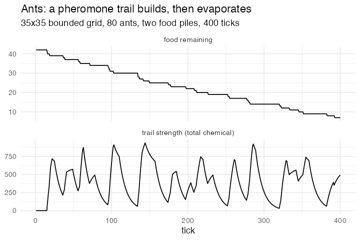

# 6. Ants, pheromone foraging (Ants, NetLogo Models Library, Wilensky 1997)

**Concept**

- Setup: a 35×35 bounded grid with a nest at the centre and two food piles; 80
  ants standing on the nest
- Go: an ant carrying food heads up the nest-scent gradient and drops pheromone
  behind it; an ant not carrying heads up the pheromone gradient; the chemical
  field diffuses and evaporates
- Output: trails form to each pile, the piles are emptied one after the other,
  and the trails evaporate once a pile is spent

**Package**

```r
world <- abm_setup(
  agents = list(
    patches = abm_agents(
      nest       = ~sqrt((.x - 18)^2 + (.y - 18)^2) < 3,
      nest_scent = ~200 - sqrt((.x - 18)^2 + (.y - 18)^2),
      food = ~as.integer(((.x - 27)^2 + (.y - 18)^2 < 7) |
                         ((.x - 18)^2 + (.y - 7)^2 < 7)),
      chemical = 0, deposit = 0, eaten = 0L),
    ants = abm_agents(n = 80, carrying = FALSE, at = ~which(nest)[1])),
  network = abm_network(type = "grid", dims = c(35, 35), on = "patches",
                        diagonals = TRUE, torus = FALSE),
  globals = list(evap = 0.10, diff = 0.30, wiggle = 4))

go <- abm_go(
  abm_rules(deposit ~ 0, eaten ~ 0L, .scope = "population"),

  # what the ant is standing on
  abm_neighbours(here_food ~ sum(food), here_nest ~ any(nest),
                 here_chem ~ sum(chemical),
                 within = .id == own_.cell & .group == "patches"),

  abm_tell(eaten ~ 1L, to = .cell, .resolve = "sum",
           when = .group == "ants" & !carrying & here_food > 0),
  abm_rules(carrying ~ case_when(!carrying & here_food > 0 ~ TRUE,
                                 carrying & here_nest      ~ FALSE,
                                 TRUE ~ carrying), .scope = "population"),
  abm_tell(deposit ~ 60, to = .cell, .resolve = "sum",
           when = .group == "ants" & carrying),

  # NetLogo `diffuse` + evaporation, then this tick's deposits
  abm_neighbours(inflow ~ sum(chemical)),
  abm_rules(food     ~ pmax(0L, food - eaten),
            chemical ~ (1 - evap) * ((1 - diff) * chemical + diff * inflow / 8) +
                       deposit,
            .scope = "population"),

  abm_move(along = "patches", who = "ants",
           to = uphill(if_else(carrying, nest_scent,
                               chemical + runif(n()) * wiggle))),

  abm_global(food_left ~ sum(food, na.rm = TRUE),
             chem_total ~ round(sum(chemical, na.rm = TRUE)))
)

result <- abm_run(world, go, ticks = 400, seed = 1, record = "globals")
```

*Everything Wolf–Sheep needs, plus a diffusing and evaporating scalar field on
the patches and gradient-following movement. The diffusion is a documented
two-line idiom over steps that already exist rather than a new one:
`abm_neighbours(inflow ~ sum(chemical))` then one `abm_rules()` that folds
inflow, evaporation and this tick's deposits together.
`abm_move(to = uphill(...))` is the argmax flavour of the same step Wolf–Sheep
needs.*

*Two corrections to the design probe's sketch, and both are the grammar behaving
as documented. `abm_tell()`'s right-hand side is evaluated in the **sender's**
row, so the sketch's `abm_tell(chemical ~ chemical + 60, to = .cell)` reads the
**ant's** `chemical`, which does not exist. An additive deposit wants a per-tick
mailbox column: cleared at the top of the tick, written by every ant on the cell
with `.resolve = "sum"`, then folded into the field. And a pure lattice argmax
traps an ant on a local maximum and it stops finding food — the probe flagged
this as the likely friction, and it is. A small random term inside `uphill()`,
the lattice analogue of NetLogo's `wiggle`, is what makes trails form at all.*

**Replication**

35 of 42 food units taken in 400 ticks. Trail strength peaks at 938 and then
decays as the piles are spent and the deposits stop.



**Reproduce:** [`06-ants.R`](scripts/06-ants.R)

---

← [5. Wolf–Sheep–Grass](05-wolf-sheep.md) · [all spatial models](README.md) · [9. Langton's Ant](09-langton.md) →
