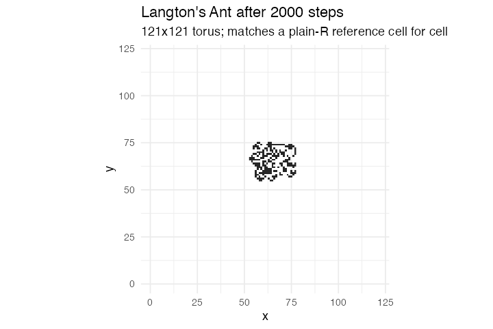

# 9. Langton's Ant (a Turmites variant, NetLogo Models Library)

**Concept**

- Setup: a 121×121 torus of white cells and one ant at the centre facing north
- Go: turn right on a white cell and left on a black one, flip the cell, step
  forward one square
- Output: about ten thousand steps of apparent chaos, and then a period-104
  "highway" that runs off across the lattice forever

**Package**

```r
langton <- abm_setup(
  agents = list(patches = abm_agents(white = TRUE),
                ant     = abm_agents(n = 1, heading = 0L, at = ~start)),
  network = abm_network(type = "grid", dims = c(121, 121), on = "patches",
                        diagonals = FALSE, torus = TRUE))

go <- abm_go(
  abm_neighbours(here_white ~ all(white),
                 within = .id == own_.cell & .group == "patches"),
  abm_rules(heading ~ (heading + if_else(here_white, 1L, 3L)) %% 4L,
            .scope = "population"),
  # the ant already knows the cell's colour, so it writes back what it read
  abm_tell(white ~ !here_white, to = .cell),
  abm_move(along = "patches", who = "ant", direction = heading)
)

result <- abm_run(langton, go, ticks = 2000, seed = 1, record = "final")
```

*The **L2+** step. The L2 bundle already covers reading the cell (`within =`),
flipping it (`abm_tell(to = .cell)`) and turning (an `abm_rules()` on
`heading`). What this model adds is `abm_move(direction = <column>)` — step one
cell along a stored compass heading, which is L1 (the lattice knows which
neighbour is north) and L2 (the mover is on a cell but is not itself on the
lattice) at the same time.*

*Note that the ant writes back what it read rather than reading the cell twice:
`abm_tell(white ~ !here_white, to = .cell)` sends the negation of the value the
`within =` join already delivered, so the flip cannot desynchronise from the
turn.*

**Replication**

The model is deterministic, so this is checked against a plain-R reference
implementation rather than against a summary statistic: cell for cell, plus the
ant's own position and heading, at 100, 500 and 2000 steps. All three match
exactly.



**Reproduce:** [`09-langton.R`](scripts/09-langton.R)

---

← [6. Ants](06-ants.md) · [all spatial models](README.md) · [10. Ising](10-ising.md) →
