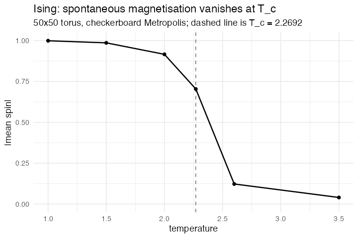

# 10. Ising model, checkerboard (Ising, NetLogo Models Library, Wilensky 2003)

**Concept**

- Setup: a 50×50 torus of spins, all +1, with a temperature global
- Go: Metropolis on one sublattice, then the other — flip a spin if it lowers
  the energy, or with probability exp(−ΔE/T) if it does not
- Output: below the critical temperature the lattice holds a spontaneous
  magnetisation; above it, the magnetisation is gone

**Package**

```r
sweep <- function(side) list(
  abm_neighbours(nbr ~ sum(spin)),
  abm_rules(spin ~ {
    Ediff  <- 2 * spin * nbr
    accept <- (Ediff <= 0) | (runif(n()) < exp(-Ediff / temp))
    if_else(black == side & accept, -spin, spin)
  })
)

ising <- abm_setup(
  agents  = abm_agents(spin  = ~rep(1L, n),          # ordered start
                       black = ~(.x + .y) %% 2 == 0),
  network = abm_network(type = "grid", dims = c(50, 50),
                        diagonals = FALSE, torus = TRUE),
  globals = list(temp = 2.27), seed = 1)

go <- do.call(abm_go, c(sweep(TRUE), sweep(FALSE),
                        list(abm_global(mag ~ abs(mean(spin))))))

result <- abm_run(ising, go, ticks = 400, seed = 1, record = "globals")
```

*L0, and the interesting part is what it cannot do. On a bipartite lattice every
site's neighbours lie on the **other** sublattice, so all black sites can be
updated at once and then all white ones — a standard, physically valid parallel
scheme, and `black = ~(.x + .y) %% 2 == 0` is the whole of declaring it.*

*The literal NetLogo dynamics — one site at a time, in random order, each
reading neighbours that may already have flipped this tick — is **not**
expressible. `abm_sequential()` processes agents one at a time but can read only
its own row and the globals, never a neighbour. That is a real limit, and it is
on [open items](../open-items.md). The naive short form, one `abm_rules()` over
the whole lattice with no sublattice split, runs and is subtly wrong:
simultaneous updates on a bipartite graph oscillate rather than equilibrate.*

**Replication**

Magnetisation falls from 0.999 at *T* = 1.0 to 0.040 at *T* = 3.5, with the
susceptibility peaking at the Onsager temperature
*T*<sub>c</sub> = 2 / ln(1 + √2) = 2.2692.

Started ordered and equilibrated, which is how spontaneous magnetisation is
measured. Quenching from a random start instead traps the lattice in striped
metastable states at low *T* — a finite-size artefact of the model, not of the
grammar.



**Reproduce:** [`10-ising.R`](scripts/10-ising.R)

---

← [9. Langton's Ant](09-langton.md) · [all spatial models](README.md) · [11. Daisyworld](11-daisyworld.md) →
