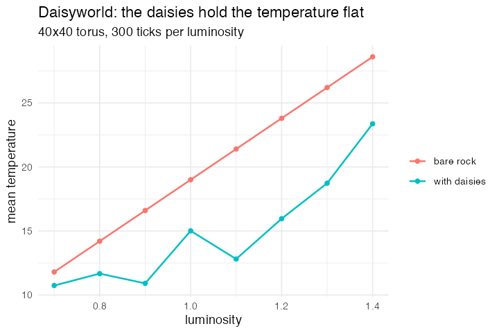

# 11. Daisyworld (Daisyworld, NetLogo Models Library, after Watson & Lovelock 1983)

**Concept**

- Setup: a 40×40 torus, each patch bare or holding a black or a white daisy
- Go: albedo sets each patch's local temperature, temperature diffuses to
  neighbours, daisies age and die, and an empty patch is seeded from a random
  daisy neighbour with a probability that peaks at 22.5°
- Output: the planet's mean temperature stays far flatter across a range of
  luminosities than the bare physics would give, because the black/white mix
  shifts to hold it there

**Package**

```r
daisy <- abm_setup(
  agents = abm_agents(
    kind = ~sample(c("white", "black", "none"), n, TRUE, c(0.2, 0.2, 0.6)),
    age  = 0L),
  network = abm_network(type = "grid", dims = c(40, 40),
                        diagonals = TRUE, torus = TRUE),
  globals = list(luminosity = 1.0, global_temp = 0), seed = 1)

go <- abm_go(
  abm_rules(albedo ~ case_when(kind == "white" ~ 0.75,
                               kind == "black" ~ 0.25,
                               TRUE            ~ 0.40), .scope = "population"),
  abm_rules(local_t ~ luminosity * (1 - albedo) * 40 - 5, .scope = "population"),
  abm_neighbours(t_in ~ mean(local_t)),
  abm_rules(temperature ~ 0.5 * local_t + 0.5 * t_in),

  abm_rules(age  ~ if_else(kind != "none", age + 1L, 0L),
            kind ~ if_else(age > 25L, "none", kind), .scope = "population"),

  abm_match(pair = "network", eligible = kind == "none"),
  abm_rules(kind ~ if_else(
    !is.na(partner_kind) & partner_kind != "none" &
      runif(n()) < pmax(0, 1 - ((temperature - 22.5) / 17.5)^2),
    partner_kind, kind)),

  abm_global(global_temp ~ mean(temperature),
             white_f ~ mean(kind == "white"),
             black_f ~ mean(kind == "black"),
             bare_t  ~ mean(luminosity * (1 - 0.40) * 40 - 5))
)

result <- abm_run(daisy, go, ticks = 300, seed = 1, record = "globals")
```

*L0, and it needs nothing past the lattice constructor — which is the useful
proof that "patch-only" is not the same as "simple". A two-way global/lattice
feedback loop, age structure and neighbour-seeded reproduction all fall out of
steps that already exist: seeding an empty patch from a random daisy neighbour
is just `abm_match(pair = "network")`.*

*Note the two separate `abm_rules()` calls for `albedo` and `local_t`. Every
rule in one call sees the state at the **start** of the step, so a rule cannot
read a column another rule in the same call has just written. The design probe's
sketch put them in one call; that is the third of its three corrections, and
again it is the grammar behaving as documented.*

**Replication**

Across luminosity 0.7 to 1.4 the planetary temperature spans 12.7 degrees while
bare rock over the same range spans 16.8. The white daisy fraction rises 0.34 →
0.66 to hold it there.



**Reproduce:** [`11-daisyworld.R`](scripts/11-daisyworld.R)

---

← [10. Ising](10-ising.md) · [all spatial models](README.md) · [13. Rebellion](13-rebellion.md) →
