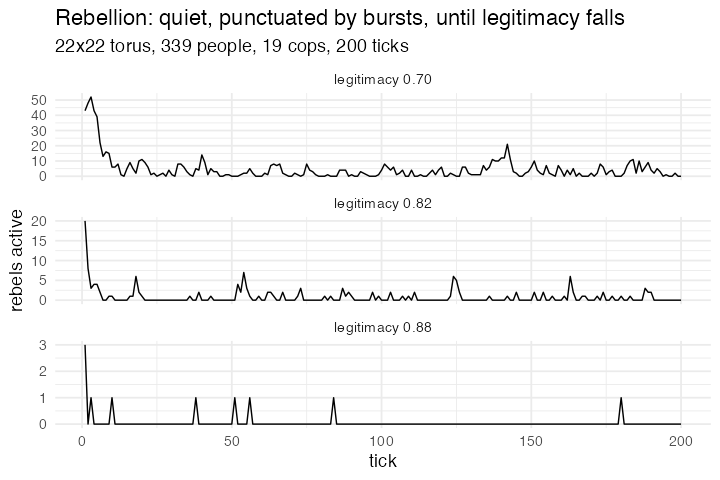

# 13. Rebellion (Rebellion, NetLogo Models Library, Wilensky 2004, after Epstein 2002)

**Concept**

- Setup: a 22×22 torus of bare slots, 339 people with a private hardship and
  risk aversion, and 19 cops
- Go: everyone moves to a random empty neighbouring cell; a person turns active
  when perceived hardship beats the perceived risk of arrest, counted over
  everyone within vision; a cop arrests one active person it can see and jails
  them for a random term
- Output: punctuated equilibrium — long quiet stretches broken by short bursts —
  and a legitimacy threshold below which the quiet stops coming back

**Package**

```r
rebel <- abm_setup(
  agents = list(
    patches = abm_agents(z = 0),
    people  = abm_agents(n = 339, risk = ~runif(n),
                         hardship = ~runif(n), active = FALSE, jail = 0L),
    cops    = abm_agents(n = 19)),
  network = abm_network(type = "grid", dims = c(22, 22), on = "patches",
                        torus = TRUE),
  globals = list(legitimacy = 0.82, threshold = 0.1, vision = 3, max_jail = 30),
  seed = 1)

go <- abm_go(
  abm_move(along = "patches", to = "random_empty_neighbour",
           who = c("people", "cops")),
  abm_neighbours(
    C ~ sum(.group == "cops"),
    A ~ 1 + sum(.group == "people" & active),
    within = .group != "patches" & .id != own_.id &
             abs(.x - own_.x) <= vision & abs(.y - own_.y) <= vision),
  abm_rules(active ~ jail == 0L &
      (hardship * (1 - legitimacy) - risk * (1 - exp(-2.3 * C / A)) > threshold),
    .scope = "population"),
  abm_match(pair = "one_of", eligible = .group == "cops",
            among = .group == "people" & active),
  abm_tell(active ~ FALSE, jail ~ sample.int(max_jail, 1L), to = .partner,
           when = .group == "cops" & !is.na(.partner)),
  abm_rules(jail ~ pmax(0L, jail - 1L), .scope = "population"),
  abm_global(n_active ~ sum(active, na.rm = TRUE),
             n_jail   ~ sum(jail > 0, na.rm = TRUE))
)

result <- abm_run(rebel, go, ticks = 200, seed = 1, record = "globals")
```

*L2+, and a canonical social-science model landing in the same bucket as
Wolf–Sheep is the useful signal: the L2 bundle is not biology-specific.
`abm_move(to = "random_empty_neighbour")` is the `avoid_occupied` flavour of the
move step, and the arrest is `abm_match(pair = "one_of", among =)` plus
`abm_tell(to = .partner)`, both of which already existed for the non-spatial
corpus.*

*The vision count is a `within =` on `.x` / `.y`, which is why turtles need
coordinates and not just a `.cell` id — the engine keeps `.x` / `.y` equal to
the coordinates of `.cell` for any agent that has one.*

*A cost note, because this one is the reason the run is kept small. A range
condition inside `abm_neighbours(within =)` builds every (focal, candidate) pair
and then filters, which is quadratic in the population. The co-location form
`within = .group == "patches" & .id == own_.cell` is different: an equality
against an `own_` column is recognised and resolved as a hash join, so
Wolf–Sheep and Ants pay only a linear cost for theirs.*

**Replication**

Quiet ticks — those with two or fewer rebels active — go 100% → 92% → 56% as
legitimacy falls 0.88 → 0.82 → 0.70. High legitimacy gives long quiet stretches
broken by short bursts; lowering it past a threshold flips the system to
sustained rebellion.



**Reproduce:** [`13-rebellion.R`](scripts/13-rebellion.R)

---

← [11. Daisyworld](11-daisyworld.md) · [all spatial models](README.md)
